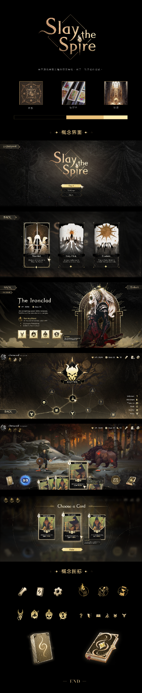

# dark-gold-concept · ArtReferences

来源：用户上传 · 暗黑长途.png。作者和外链未提供；保留上传原字节及可见画面，不标注为官方或 CC0。

本目录 1 个原文件/解包文件，0 个配套透明PNG。用途为本仓库的原型建议；无三维模型。

| 文件 | 实测规格 | 内容与用途 | 来源/作者 |
|---|---|---|---|
| [dark-gold-longboard.png](dark-gold-longboard.png) | 420×2048 · RGBA · 1,211,797 B | 用户提供的黑金界面概念长图；用于菜单、选人、地图、战斗与奖励布局参考 | 用户上传 |

[完整来源/哈希清单](../../Collections/community-supplement-2026-10/manifest.json) · [本批总览](../../Collections/community-supplement-2026-10/README.md)。未启动Unity、未验证导入、材质或运行效果。

## 画面与借鉴方向

原文件名：暗黑长途.png；420×2048，RGBA，1,211,797 B。它是一张合成概念长图，画面包含Logo、灵感图片、主菜单、模式选择、角色选择、路线地图、战斗、奖励和概念图标。原字节保留，未裁切、未放大、未重新绘制；作者名称与原发布地址未确认。

| 原图区域（顶部起算，约值） | 内容 | 气象游戏中的用法 |
|---|---|---|
| y=0–410 | Logo、灵感与配色 | 黑色石质底、旧金装饰、局部高亮
| y=410–620 | 主菜单 | 风暴云层背景配金色闪电，保持按钮文字清晰
| y=620–830 | 模式选择 | 不同气候章节使用三张竖向入口卡
| y=830–1045 | 选人界面 | 左侧能力介绍，右侧角色，底部天气派系
| y=1045–1250 | 路线地图 | 细金线连接气象站/雷暴/避风营地节点
| y=1250–1470 | 战斗界面 | 顶部资源与状态，底部手牌和天气能量
| y=1470–1685 | 卡牌奖励 | 三选一卡牌突出轮廓，压暗战斗背景
| y=1685–2048 | 概念图标与卡背 | 装饰、图标权重与卡背设计参考

这些坐标只用于阅读长图，不作为可导入Sprite切片。420px宽限制了文字与小图标清晰度，后续制作应依据原资源重建布局。

