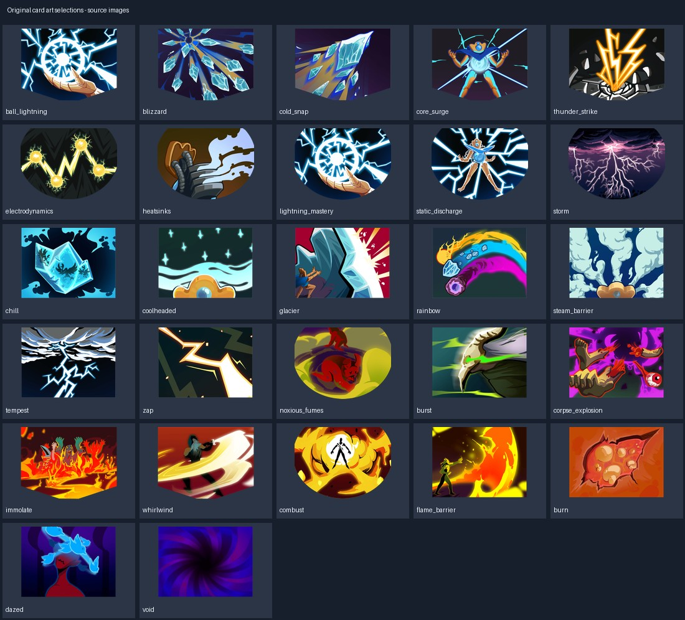

# 原版精选 · 卡牌插画候选

按画面与文件名筛出的雷、冰、蒸汽、风、烟雾、热量和少量技能/状态插画例外；不沿用原卡规则。

本类保留 27 个源文件，约 1.04 MiB。文件内容保留原样；整体来源见 [本批说明](../../Collections/sts-original/README.md)。

## 分组说明

| 分组 | 文件数 | 主要情况 |
|---|---:|---|
| [blue](blue/README.md) | 17 | 卡牌插画候选文件逐项规格/用途 |
| [green](green/README.md) | 3 | 卡牌插画候选文件逐项规格/用途 |
| [red](red/README.md) | 4 | 卡牌插画候选文件逐项规格/用途 |
| [status](status/README.md) | 3 | 卡牌插画候选文件逐项规格/用途 |
