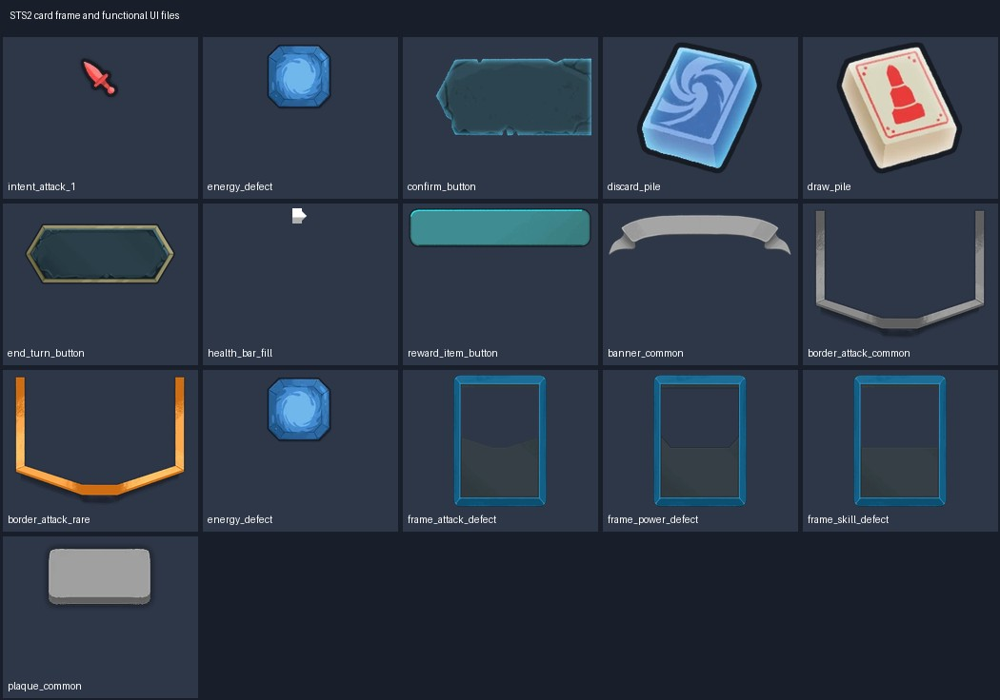

# Spire Codex · 卡框与费用标记

来源为《Slay the Spire 2》主版本 v0.107.1 的站点导出图/预渲染结果。本类 60 项选用来源；[总说明](../../Collections/spire-codex-sts2/README.md)记录下载、来源与验证范围。

## atlas-sprites/ui_atlas

| 资源/PNG入口 | 规格 | 用途 | 原下载与存档 |
|---|---|---|---|
| [atlas-sprites/ui_atlas/card/ancient_banner](assets/atlas-sprites/ui_atlas/card/ancient_banner.png) | 671×182 RGBA | 卡牌标题横幅：ancient_banner；标题用TMP等文字组件显示 | [源WebP](https://cdn.spire-codex.com/game/v0.107.1/assets/atlas-sprites/ui_atlas/card/ancient_banner.webp) / [原文件ZIP](../../Sources/spire-codex-sts2/cardframes-01.zip)（成员 `assets/atlas-sprites/ui_atlas/card/ancient_banner.webp`） |
| [atlas-sprites/ui_atlas/card/card_banner](assets/atlas-sprites/ui_atlas/card/card_banner.png) | 655×170 RGBA | 卡牌标题横幅：card_banner；标题用TMP等文字组件显示 | [源WebP](https://cdn.spire-codex.com/game/v0.107.1/assets/atlas-sprites/ui_atlas/card/card_banner.webp) / [原文件ZIP](../../Sources/spire-codex-sts2/cardframes-01.zip)（成员 `assets/atlas-sprites/ui_atlas/card/card_banner.webp`） |
| [atlas-sprites/ui_atlas/card/card_enchant_s](assets/atlas-sprites/ui_atlas/card/card_enchant_s.png) | 100×76 RGBA | 小卡/费用/不可打出标志：card_enchant_s | [源WebP](https://cdn.spire-codex.com/game/v0.107.1/assets/atlas-sprites/ui_atlas/card/card_enchant_s.webp) / [原文件ZIP](../../Sources/spire-codex-sts2/cardframes-01.zip)（成员 `assets/atlas-sprites/ui_atlas/card/card_enchant_s.webp`） |
| [atlas-sprites/ui_atlas/card/card_frame_ancient_s](assets/atlas-sprites/ui_atlas/card/card_frame_ancient_s.png) | 673×866 RGBA | 卡牌底框/职业颜色：card_frame_ancient_s；颜色仅作原型视觉区分 | [源WebP](https://cdn.spire-codex.com/game/v0.107.1/assets/atlas-sprites/ui_atlas/card/card_frame_ancient_s.webp) / [原文件ZIP](../../Sources/spire-codex-sts2/cardframes-01.zip)（成员 `assets/atlas-sprites/ui_atlas/card/card_frame_ancient_s.webp`） |
| [atlas-sprites/ui_atlas/card/card_frame_attack_s](assets/atlas-sprites/ui_atlas/card/card_frame_attack_s.png) | 598×844 RGBA | 卡牌底框/职业颜色：card_frame_attack_s；颜色仅作原型视觉区分 | [源WebP](https://cdn.spire-codex.com/game/v0.107.1/assets/atlas-sprites/ui_atlas/card/card_frame_attack_s.webp) / [原文件ZIP](../../Sources/spire-codex-sts2/cardframes-01.zip)（成员 `assets/atlas-sprites/ui_atlas/card/card_frame_attack_s.webp`） |
| [atlas-sprites/ui_atlas/card/card_frame_power_s](assets/atlas-sprites/ui_atlas/card/card_frame_power_s.png) | 598×844 RGBA | 卡牌底框/职业颜色：card_frame_power_s；颜色仅作原型视觉区分 | [源WebP](https://cdn.spire-codex.com/game/v0.107.1/assets/atlas-sprites/ui_atlas/card/card_frame_power_s.webp) / [原文件ZIP](../../Sources/spire-codex-sts2/cardframes-01.zip)（成员 `assets/atlas-sprites/ui_atlas/card/card_frame_power_s.webp`） |
| [atlas-sprites/ui_atlas/card/card_frame_quest_s](assets/atlas-sprites/ui_atlas/card/card_frame_quest_s.png) | 599×844 RGBA | 卡牌底框/职业颜色：card_frame_quest_s；颜色仅作原型视觉区分 | [源WebP](https://cdn.spire-codex.com/game/v0.107.1/assets/atlas-sprites/ui_atlas/card/card_frame_quest_s.webp) / [原文件ZIP](../../Sources/spire-codex-sts2/cardframes-01.zip)（成员 `assets/atlas-sprites/ui_atlas/card/card_frame_quest_s.webp`） |
| [atlas-sprites/ui_atlas/card/card_frame_skill_s](assets/atlas-sprites/ui_atlas/card/card_frame_skill_s.png) | 598×844 RGBA | 卡牌底框/职业颜色：card_frame_skill_s；颜色仅作原型视觉区分 | [源WebP](https://cdn.spire-codex.com/game/v0.107.1/assets/atlas-sprites/ui_atlas/card/card_frame_skill_s.webp) / [原文件ZIP](../../Sources/spire-codex-sts2/cardframes-01.zip)（成员 `assets/atlas-sprites/ui_atlas/card/card_frame_skill_s.webp`） |
| [atlas-sprites/ui_atlas/card/card_portrait_border_attack_s](assets/atlas-sprites/ui_atlas/card/card_portrait_border_attack_s.png) | 551×420 RGBA | 小卡插画区域边框：card_portrait_border_attack_s | [源WebP](https://cdn.spire-codex.com/game/v0.107.1/assets/atlas-sprites/ui_atlas/card/card_portrait_border_attack_s.webp) / [原文件ZIP](../../Sources/spire-codex-sts2/cardframes-01.zip)（成员 `assets/atlas-sprites/ui_atlas/card/card_portrait_border_attack_s.webp`） |
| [atlas-sprites/ui_atlas/card/card_portrait_border_plaque_s](assets/atlas-sprites/ui_atlas/card/card_portrait_border_plaque_s.png) | 123×75 RGBA | 卡牌文字区底板：card_portrait_border_plaque_s；按画面尺寸适配 | [源WebP](https://cdn.spire-codex.com/game/v0.107.1/assets/atlas-sprites/ui_atlas/card/card_portrait_border_plaque_s.webp) / [原文件ZIP](../../Sources/spire-codex-sts2/cardframes-01.zip)（成员 `assets/atlas-sprites/ui_atlas/card/card_portrait_border_plaque_s.webp`） |
| [atlas-sprites/ui_atlas/card/card_portrait_border_power_s](assets/atlas-sprites/ui_atlas/card/card_portrait_border_power_s.png) | 551×420 RGBA | 小卡插画区域边框：card_portrait_border_power_s | [源WebP](https://cdn.spire-codex.com/game/v0.107.1/assets/atlas-sprites/ui_atlas/card/card_portrait_border_power_s.webp) / [原文件ZIP](../../Sources/spire-codex-sts2/cardframes-01.zip)（成员 `assets/atlas-sprites/ui_atlas/card/card_portrait_border_power_s.webp`） |
| [atlas-sprites/ui_atlas/card/card_portrait_border_skill_s](assets/atlas-sprites/ui_atlas/card/card_portrait_border_skill_s.png) | 551×420 RGBA | 小卡插画区域边框：card_portrait_border_skill_s | [源WebP](https://cdn.spire-codex.com/game/v0.107.1/assets/atlas-sprites/ui_atlas/card/card_portrait_border_skill_s.webp) / [原文件ZIP](../../Sources/spire-codex-sts2/cardframes-01.zip)（成员 `assets/atlas-sprites/ui_atlas/card/card_portrait_border_skill_s.webp`） |
| [atlas-sprites/ui_atlas/card/card_unplayable_icon](assets/atlas-sprites/ui_atlas/card/card_unplayable_icon.png) | 104×104 RGBA | 小卡/费用/不可打出标志：card_unplayable_icon | [源WebP](https://cdn.spire-codex.com/game/v0.107.1/assets/atlas-sprites/ui_atlas/card/card_unplayable_icon.webp) / [原文件ZIP](../../Sources/spire-codex-sts2/cardframes-01.zip)（成员 `assets/atlas-sprites/ui_atlas/card/card_unplayable_icon.webp`） |
| [atlas-sprites/ui_atlas/card/energy_colorless](assets/atlas-sprites/ui_atlas/card/energy_colorless.png) | 74×74 RGBA | 费用/能量图标底图：energy_colorless；费用数字单独绘制 | [源WebP](https://cdn.spire-codex.com/game/v0.107.1/assets/atlas-sprites/ui_atlas/card/energy_colorless.webp) / [原文件ZIP](../../Sources/spire-codex-sts2/cardframes-01.zip)（成员 `assets/atlas-sprites/ui_atlas/card/energy_colorless.webp`） |
| [atlas-sprites/ui_atlas/card/energy_defect](assets/atlas-sprites/ui_atlas/card/energy_defect.png) | 74×74 RGBA | 费用/能量图标底图：energy_defect；费用数字单独绘制 | [源WebP](https://cdn.spire-codex.com/game/v0.107.1/assets/atlas-sprites/ui_atlas/card/energy_defect.webp) / [原文件ZIP](../../Sources/spire-codex-sts2/cardframes-01.zip)（成员 `assets/atlas-sprites/ui_atlas/card/energy_defect.webp`） |
| [atlas-sprites/ui_atlas/card/energy_ironclad](assets/atlas-sprites/ui_atlas/card/energy_ironclad.png) | 74×74 RGBA | 费用/能量图标底图：energy_ironclad；费用数字单独绘制 | [源WebP](https://cdn.spire-codex.com/game/v0.107.1/assets/atlas-sprites/ui_atlas/card/energy_ironclad.webp) / [原文件ZIP](../../Sources/spire-codex-sts2/cardframes-01.zip)（成员 `assets/atlas-sprites/ui_atlas/card/energy_ironclad.webp`） |
| [atlas-sprites/ui_atlas/card/energy_necrobinder](assets/atlas-sprites/ui_atlas/card/energy_necrobinder.png) | 74×74 RGBA | 费用/能量图标底图：energy_necrobinder；费用数字单独绘制 | [源WebP](https://cdn.spire-codex.com/game/v0.107.1/assets/atlas-sprites/ui_atlas/card/energy_necrobinder.webp) / [原文件ZIP](../../Sources/spire-codex-sts2/cardframes-01.zip)（成员 `assets/atlas-sprites/ui_atlas/card/energy_necrobinder.webp`） |
| [atlas-sprites/ui_atlas/card/energy_quest](assets/atlas-sprites/ui_atlas/card/energy_quest.png) | 74×74 RGBA | 费用/能量图标底图：energy_quest；费用数字单独绘制 | [源WebP](https://cdn.spire-codex.com/game/v0.107.1/assets/atlas-sprites/ui_atlas/card/energy_quest.webp) / [原文件ZIP](../../Sources/spire-codex-sts2/cardframes-01.zip)（成员 `assets/atlas-sprites/ui_atlas/card/energy_quest.webp`） |
| [atlas-sprites/ui_atlas/card/energy_regent](assets/atlas-sprites/ui_atlas/card/energy_regent.png) | 74×74 RGBA | 费用/能量图标底图：energy_regent；费用数字单独绘制 | [源WebP](https://cdn.spire-codex.com/game/v0.107.1/assets/atlas-sprites/ui_atlas/card/energy_regent.webp) / [原文件ZIP](../../Sources/spire-codex-sts2/cardframes-01.zip)（成员 `assets/atlas-sprites/ui_atlas/card/energy_regent.webp`） |
| [atlas-sprites/ui_atlas/card/energy_silent](assets/atlas-sprites/ui_atlas/card/energy_silent.png) | 74×74 RGBA | 费用/能量图标底图：energy_silent；费用数字单独绘制 | [源WebP](https://cdn.spire-codex.com/game/v0.107.1/assets/atlas-sprites/ui_atlas/card/energy_silent.webp) / [原文件ZIP](../../Sources/spire-codex-sts2/cardframes-01.zip)（成员 `assets/atlas-sprites/ui_atlas/card/energy_silent.webp`） |
## card-frames

| 资源/PNG入口 | 规格 | 用途 | 原下载与存档 |
|---|---|---|---|
| [banner_common](card-frames/banner_common.png) | 655×170 RGBA | 卡牌标题横幅：banner_common；标题用TMP等文字组件显示 | [源WebP](https://cdn.spire-codex.com/game/v0.107.1/card-frames/banner_common.webp) / [原文件ZIP](../../Sources/spire-codex-sts2/cardframes-01.zip)（成员 `card-frames/banner_common.webp`） |
| [banner_rare](card-frames/banner_rare.png) | 655×170 RGBA | 卡牌标题横幅：banner_rare；标题用TMP等文字组件显示 | [源WebP](https://cdn.spire-codex.com/game/v0.107.1/card-frames/banner_rare.webp) / [原文件ZIP](../../Sources/spire-codex-sts2/cardframes-01.zip)（成员 `card-frames/banner_rare.webp`） |
| [banner_uncommon](card-frames/banner_uncommon.png) | 655×170 RGBA | 卡牌标题横幅：banner_uncommon；标题用TMP等文字组件显示 | [源WebP](https://cdn.spire-codex.com/game/v0.107.1/card-frames/banner_uncommon.webp) / [原文件ZIP](../../Sources/spire-codex-sts2/cardframes-01.zip)（成员 `card-frames/banner_uncommon.webp`） |
| [border_attack_common](card-frames/border_attack_common.png) | 551×420 RGBA | 卡牌类型/稀有度边框：border_attack_common；与插画、底色、文字层组合 | [源WebP](https://cdn.spire-codex.com/game/v0.107.1/card-frames/border_attack_common.webp) / [原文件ZIP](../../Sources/spire-codex-sts2/cardframes-01.zip)（成员 `card-frames/border_attack_common.webp`） |
| [border_attack_rare](card-frames/border_attack_rare.png) | 551×420 RGBA | 卡牌类型/稀有度边框：border_attack_rare；与插画、底色、文字层组合 | [源WebP](https://cdn.spire-codex.com/game/v0.107.1/card-frames/border_attack_rare.webp) / [原文件ZIP](../../Sources/spire-codex-sts2/cardframes-01.zip)（成员 `card-frames/border_attack_rare.webp`） |
| [border_attack_uncommon](card-frames/border_attack_uncommon.png) | 551×420 RGBA | 卡牌类型/稀有度边框：border_attack_uncommon；与插画、底色、文字层组合 | [源WebP](https://cdn.spire-codex.com/game/v0.107.1/card-frames/border_attack_uncommon.webp) / [原文件ZIP](../../Sources/spire-codex-sts2/cardframes-01.zip)（成员 `card-frames/border_attack_uncommon.webp`） |
| [border_power_common](card-frames/border_power_common.png) | 551×420 RGBA | 卡牌类型/稀有度边框：border_power_common；与插画、底色、文字层组合 | [源WebP](https://cdn.spire-codex.com/game/v0.107.1/card-frames/border_power_common.webp) / [原文件ZIP](../../Sources/spire-codex-sts2/cardframes-01.zip)（成员 `card-frames/border_power_common.webp`） |
| [border_power_rare](card-frames/border_power_rare.png) | 551×420 RGBA | 卡牌类型/稀有度边框：border_power_rare；与插画、底色、文字层组合 | [源WebP](https://cdn.spire-codex.com/game/v0.107.1/card-frames/border_power_rare.webp) / [原文件ZIP](../../Sources/spire-codex-sts2/cardframes-01.zip)（成员 `card-frames/border_power_rare.webp`） |
| [border_power_uncommon](card-frames/border_power_uncommon.png) | 551×420 RGBA | 卡牌类型/稀有度边框：border_power_uncommon；与插画、底色、文字层组合 | [源WebP](https://cdn.spire-codex.com/game/v0.107.1/card-frames/border_power_uncommon.webp) / [原文件ZIP](../../Sources/spire-codex-sts2/cardframes-01.zip)（成员 `card-frames/border_power_uncommon.webp`） |
| [border_skill_common](card-frames/border_skill_common.png) | 551×420 RGBA | 卡牌类型/稀有度边框：border_skill_common；与插画、底色、文字层组合 | [源WebP](https://cdn.spire-codex.com/game/v0.107.1/card-frames/border_skill_common.webp) / [原文件ZIP](../../Sources/spire-codex-sts2/cardframes-01.zip)（成员 `card-frames/border_skill_common.webp`） |
| [border_skill_rare](card-frames/border_skill_rare.png) | 551×420 RGBA | 卡牌类型/稀有度边框：border_skill_rare；与插画、底色、文字层组合 | [源WebP](https://cdn.spire-codex.com/game/v0.107.1/card-frames/border_skill_rare.webp) / [原文件ZIP](../../Sources/spire-codex-sts2/cardframes-01.zip)（成员 `card-frames/border_skill_rare.webp`） |
| [border_skill_uncommon](card-frames/border_skill_uncommon.png) | 551×420 RGBA | 卡牌类型/稀有度边框：border_skill_uncommon；与插画、底色、文字层组合 | [源WebP](https://cdn.spire-codex.com/game/v0.107.1/card-frames/border_skill_uncommon.webp) / [原文件ZIP](../../Sources/spire-codex-sts2/cardframes-01.zip)（成员 `card-frames/border_skill_uncommon.webp`） |
| [energy_colorless](card-frames/energy_colorless.png) | 74×74 RGBA | 费用/能量图标底图：energy_colorless；费用数字单独绘制 | [源WebP](https://cdn.spire-codex.com/game/v0.107.1/card-frames/energy_colorless.webp) / [原文件ZIP](../../Sources/spire-codex-sts2/cardframes-01.zip)（成员 `card-frames/energy_colorless.webp`） |
| [energy_defect](card-frames/energy_defect.png) | 74×74 RGBA | 费用/能量图标底图：energy_defect；费用数字单独绘制 | [源WebP](https://cdn.spire-codex.com/game/v0.107.1/card-frames/energy_defect.webp) / [原文件ZIP](../../Sources/spire-codex-sts2/cardframes-01.zip)（成员 `card-frames/energy_defect.webp`） |
| [energy_ironclad](card-frames/energy_ironclad.png) | 74×74 RGBA | 费用/能量图标底图：energy_ironclad；费用数字单独绘制 | [源WebP](https://cdn.spire-codex.com/game/v0.107.1/card-frames/energy_ironclad.webp) / [原文件ZIP](../../Sources/spire-codex-sts2/cardframes-01.zip)（成员 `card-frames/energy_ironclad.webp`） |
| [energy_necrobinder](card-frames/energy_necrobinder.png) | 74×74 RGBA | 费用/能量图标底图：energy_necrobinder；费用数字单独绘制 | [源WebP](https://cdn.spire-codex.com/game/v0.107.1/card-frames/energy_necrobinder.webp) / [原文件ZIP](../../Sources/spire-codex-sts2/cardframes-01.zip)（成员 `card-frames/energy_necrobinder.webp`） |
| [energy_regent](card-frames/energy_regent.png) | 74×74 RGBA | 费用/能量图标底图：energy_regent；费用数字单独绘制 | [源WebP](https://cdn.spire-codex.com/game/v0.107.1/card-frames/energy_regent.webp) / [原文件ZIP](../../Sources/spire-codex-sts2/cardframes-01.zip)（成员 `card-frames/energy_regent.webp`） |
| [energy_silent](card-frames/energy_silent.png) | 74×74 RGBA | 费用/能量图标底图：energy_silent；费用数字单独绘制 | [源WebP](https://cdn.spire-codex.com/game/v0.107.1/card-frames/energy_silent.webp) / [原文件ZIP](../../Sources/spire-codex-sts2/cardframes-01.zip)（成员 `card-frames/energy_silent.webp`） |
| [frame_attack_colorless](card-frames/frame_attack_colorless.png) | 598×844 RGBA | 卡牌底框/职业颜色：frame_attack_colorless；颜色仅作原型视觉区分 | [源WebP](https://cdn.spire-codex.com/game/v0.107.1/card-frames/frame_attack_colorless.webp) / [原文件ZIP](../../Sources/spire-codex-sts2/cardframes-01.zip)（成员 `card-frames/frame_attack_colorless.webp`） |
| [frame_attack_defect](card-frames/frame_attack_defect.png) | 598×844 RGBA | 卡牌底框/职业颜色：frame_attack_defect；颜色仅作原型视觉区分 | [源WebP](https://cdn.spire-codex.com/game/v0.107.1/card-frames/frame_attack_defect.webp) / [原文件ZIP](../../Sources/spire-codex-sts2/cardframes-01.zip)（成员 `card-frames/frame_attack_defect.webp`） |
| [frame_attack_ironclad](card-frames/frame_attack_ironclad.png) | 598×844 RGBA | 卡牌底框/职业颜色：frame_attack_ironclad；颜色仅作原型视觉区分 | [源WebP](https://cdn.spire-codex.com/game/v0.107.1/card-frames/frame_attack_ironclad.webp) / [原文件ZIP](../../Sources/spire-codex-sts2/cardframes-01.zip)（成员 `card-frames/frame_attack_ironclad.webp`） |
| [frame_attack_necrobinder](card-frames/frame_attack_necrobinder.png) | 598×844 RGBA | 卡牌底框/职业颜色：frame_attack_necrobinder；颜色仅作原型视觉区分 | [源WebP](https://cdn.spire-codex.com/game/v0.107.1/card-frames/frame_attack_necrobinder.webp) / [原文件ZIP](../../Sources/spire-codex-sts2/cardframes-01.zip)（成员 `card-frames/frame_attack_necrobinder.webp`） |
| [frame_attack_regent](card-frames/frame_attack_regent.png) | 598×844 RGBA | 卡牌底框/职业颜色：frame_attack_regent；颜色仅作原型视觉区分 | [源WebP](https://cdn.spire-codex.com/game/v0.107.1/card-frames/frame_attack_regent.webp) / [原文件ZIP](../../Sources/spire-codex-sts2/cardframes-01.zip)（成员 `card-frames/frame_attack_regent.webp`） |
| [frame_attack_silent](card-frames/frame_attack_silent.png) | 598×844 RGBA | 卡牌底框/职业颜色：frame_attack_silent；颜色仅作原型视觉区分 | [源WebP](https://cdn.spire-codex.com/game/v0.107.1/card-frames/frame_attack_silent.webp) / [原文件ZIP](../../Sources/spire-codex-sts2/cardframes-01.zip)（成员 `card-frames/frame_attack_silent.webp`） |
| [frame_power_colorless](card-frames/frame_power_colorless.png) | 598×844 RGBA | 卡牌底框/职业颜色：frame_power_colorless；颜色仅作原型视觉区分 | [源WebP](https://cdn.spire-codex.com/game/v0.107.1/card-frames/frame_power_colorless.webp) / [原文件ZIP](../../Sources/spire-codex-sts2/cardframes-01.zip)（成员 `card-frames/frame_power_colorless.webp`） |
| [frame_power_defect](card-frames/frame_power_defect.png) | 598×844 RGBA | 卡牌底框/职业颜色：frame_power_defect；颜色仅作原型视觉区分 | [源WebP](https://cdn.spire-codex.com/game/v0.107.1/card-frames/frame_power_defect.webp) / [原文件ZIP](../../Sources/spire-codex-sts2/cardframes-01.zip)（成员 `card-frames/frame_power_defect.webp`） |
| [frame_power_ironclad](card-frames/frame_power_ironclad.png) | 598×844 RGBA | 卡牌底框/职业颜色：frame_power_ironclad；颜色仅作原型视觉区分 | [源WebP](https://cdn.spire-codex.com/game/v0.107.1/card-frames/frame_power_ironclad.webp) / [原文件ZIP](../../Sources/spire-codex-sts2/cardframes-01.zip)（成员 `card-frames/frame_power_ironclad.webp`） |
| [frame_power_necrobinder](card-frames/frame_power_necrobinder.png) | 598×844 RGBA | 卡牌底框/职业颜色：frame_power_necrobinder；颜色仅作原型视觉区分 | [源WebP](https://cdn.spire-codex.com/game/v0.107.1/card-frames/frame_power_necrobinder.webp) / [原文件ZIP](../../Sources/spire-codex-sts2/cardframes-01.zip)（成员 `card-frames/frame_power_necrobinder.webp`） |
| [frame_power_regent](card-frames/frame_power_regent.png) | 598×844 RGBA | 卡牌底框/职业颜色：frame_power_regent；颜色仅作原型视觉区分 | [源WebP](https://cdn.spire-codex.com/game/v0.107.1/card-frames/frame_power_regent.webp) / [原文件ZIP](../../Sources/spire-codex-sts2/cardframes-01.zip)（成员 `card-frames/frame_power_regent.webp`） |
| [frame_power_silent](card-frames/frame_power_silent.png) | 598×844 RGBA | 卡牌底框/职业颜色：frame_power_silent；颜色仅作原型视觉区分 | [源WebP](https://cdn.spire-codex.com/game/v0.107.1/card-frames/frame_power_silent.webp) / [原文件ZIP](../../Sources/spire-codex-sts2/cardframes-01.zip)（成员 `card-frames/frame_power_silent.webp`） |
| [frame_skill_colorless](card-frames/frame_skill_colorless.png) | 598×844 RGBA | 卡牌底框/职业颜色：frame_skill_colorless；颜色仅作原型视觉区分 | [源WebP](https://cdn.spire-codex.com/game/v0.107.1/card-frames/frame_skill_colorless.webp) / [原文件ZIP](../../Sources/spire-codex-sts2/cardframes-01.zip)（成员 `card-frames/frame_skill_colorless.webp`） |
| [frame_skill_defect](card-frames/frame_skill_defect.png) | 598×844 RGBA | 卡牌底框/职业颜色：frame_skill_defect；颜色仅作原型视觉区分 | [源WebP](https://cdn.spire-codex.com/game/v0.107.1/card-frames/frame_skill_defect.webp) / [原文件ZIP](../../Sources/spire-codex-sts2/cardframes-01.zip)（成员 `card-frames/frame_skill_defect.webp`） |
| [frame_skill_ironclad](card-frames/frame_skill_ironclad.png) | 598×844 RGBA | 卡牌底框/职业颜色：frame_skill_ironclad；颜色仅作原型视觉区分 | [源WebP](https://cdn.spire-codex.com/game/v0.107.1/card-frames/frame_skill_ironclad.webp) / [原文件ZIP](../../Sources/spire-codex-sts2/cardframes-01.zip)（成员 `card-frames/frame_skill_ironclad.webp`） |
| [frame_skill_necrobinder](card-frames/frame_skill_necrobinder.png) | 598×844 RGBA | 卡牌底框/职业颜色：frame_skill_necrobinder；颜色仅作原型视觉区分 | [源WebP](https://cdn.spire-codex.com/game/v0.107.1/card-frames/frame_skill_necrobinder.webp) / [原文件ZIP](../../Sources/spire-codex-sts2/cardframes-01.zip)（成员 `card-frames/frame_skill_necrobinder.webp`） |
| [frame_skill_regent](card-frames/frame_skill_regent.png) | 598×844 RGBA | 卡牌底框/职业颜色：frame_skill_regent；颜色仅作原型视觉区分 | [源WebP](https://cdn.spire-codex.com/game/v0.107.1/card-frames/frame_skill_regent.webp) / [原文件ZIP](../../Sources/spire-codex-sts2/cardframes-01.zip)（成员 `card-frames/frame_skill_regent.webp`） |
| [frame_skill_silent](card-frames/frame_skill_silent.png) | 598×844 RGBA | 卡牌底框/职业颜色：frame_skill_silent；颜色仅作原型视觉区分 | [源WebP](https://cdn.spire-codex.com/game/v0.107.1/card-frames/frame_skill_silent.webp) / [原文件ZIP](../../Sources/spire-codex-sts2/cardframes-01.zip)（成员 `card-frames/frame_skill_silent.webp`） |
| [plaque_common](card-frames/plaque_common.png) | 123×75 RGBA | 卡牌文字区底板：plaque_common；按画面尺寸适配 | [源WebP](https://cdn.spire-codex.com/game/v0.107.1/card-frames/plaque_common.webp) / [原文件ZIP](../../Sources/spire-codex-sts2/cardframes-01.zip)（成员 `card-frames/plaque_common.webp`） |
| [plaque_rare](card-frames/plaque_rare.png) | 123×75 RGBA | 卡牌文字区底板：plaque_rare；按画面尺寸适配 | [源WebP](https://cdn.spire-codex.com/game/v0.107.1/card-frames/plaque_rare.webp) / [原文件ZIP](../../Sources/spire-codex-sts2/cardframes-01.zip)（成员 `card-frames/plaque_rare.webp`） |
| [plaque_uncommon](card-frames/plaque_uncommon.png) | 123×75 RGBA | 卡牌文字区底板：plaque_uncommon；按画面尺寸适配 | [源WebP](https://cdn.spire-codex.com/game/v0.107.1/card-frames/plaque_uncommon.webp) / [原文件ZIP](../../Sources/spire-codex-sts2/cardframes-01.zip)（成员 `card-frames/plaque_uncommon.webp`） |
| [unplayable_icon](card-frames/unplayable_icon.png) | 104×104 RGBA | 小卡/费用/不可打出标志：unplayable_icon | [源WebP](https://cdn.spire-codex.com/game/v0.107.1/card-frames/unplayable_icon.webp) / [原文件ZIP](../../Sources/spire-codex-sts2/cardframes-01.zip)（成员 `card-frames/unplayable_icon.webp`） |

PNG转换保留源WebP解码后的RGBA像素与透明度。图表与单张PNG均已读取检查，Unity尚未导入运行。原SHA256、图表坐标与取舍记录见[清单](../../Collections/spire-codex-sts2/manifest.json)。
