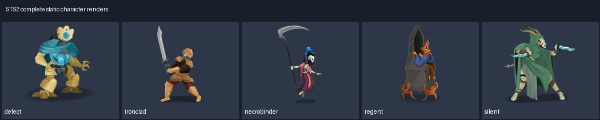

# Spire Codex · 二维人物

来源为《Slay the Spire 2》主版本 v0.107.1 的站点导出图/预渲染结果。本类 7 项选用来源；[总说明](../../Collections/spire-codex-sts2/README.md)记录下载、来源与验证范围。

## animations/characters/defect/attack.webp

| 资源/PNG入口 | 规格 | 用途 | 原下载与存档 |
|---|---|---|---|
| [characters/defect/attack](animations/characters/defect/attack/sheet_000.png) | 422×313 RGBA；31帧 / 1600ms / 2张图表 | attack：完整预渲染动作；按frames.json的帧序、矩形和时长播放 | [源WebP](https://cdn.spire-codex.com/game/v0.107.1/animations/characters/defect/attack.webp) / [原文件ZIP](../../Sources/spire-codex-sts2/characters-01.zip)（成员 `animations/characters/defect/attack.webp`） |

### 动作 characters/defect/attack.webp

完整帧数与原时长已保留；原文件loop值：`0`。一次性动作/游戏状态何时循环由项目定义，不因WebP循环标记就改变攻击行为。

| 配套文件 | 情况 |
|---|---|
| [sheet_000.png](animations/characters/defect/attack/sheet_000.png) | animation_sheet / 1688×1878 / 1915490字节 |
| [sheet_001.png](animations/characters/defect/attack/sheet_001.png) | animation_sheet / 1688×626 / 501664字节 |
| [frames.json](animations/characters/defect/attack/frames.json) | frame_metadata / 9143字节 |

## animations/characters/defect/cast.webp

| 资源/PNG入口 | 规格 | 用途 | 原下载与存档 |
|---|---|---|---|
| [characters/defect/cast](animations/characters/defect/cast/sheet_000.png) | 313×324 RGBA；26帧 / 1300ms / 1张图表 | cast：完整预渲染动作；按frames.json的帧序、矩形和时长播放 | [源WebP](https://cdn.spire-codex.com/game/v0.107.1/animations/characters/defect/cast.webp) / [原文件ZIP](../../Sources/spire-codex-sts2/characters-01.zip)（成员 `animations/characters/defect/cast.webp`） |

### 动作 characters/defect/cast.webp

完整帧数与原时长已保留；原文件loop值：`0`。一次性动作/游戏状态何时循环由项目定义，不因WebP循环标记就改变攻击行为。

| 配套文件 | 情况 |
|---|---|
| [sheet_000.png](animations/characters/defect/cast/sheet_000.png) | animation_sheet / 1878×1620 / 1656634字节 |
| [frames.json](animations/characters/defect/cast/frames.json) | frame_metadata / 7738字节 |

## characters

| 资源/PNG入口 | 规格 | 用途 | 原下载与存档 |
|---|---|---|---|
| [defect](characters/defect.png) | 263×288 RGBA | defect：已组装的完整静态二维外观，可直接作战斗Sprite；此静态文件本身无动画 | [源WebP](https://cdn.spire-codex.com/game/v0.107.1/characters/defect.webp) / [原文件ZIP](../../Sources/spire-codex-sts2/characters-01.zip)（成员 `characters/defect.webp`） |
| [ironclad](characters/ironclad.png) | 211×362 RGBA | ironclad：已组装的完整静态二维外观，可直接作战斗Sprite；此静态文件本身无动画 | [源WebP](https://cdn.spire-codex.com/game/v0.107.1/characters/ironclad.webp) / [原文件ZIP](../../Sources/spire-codex-sts2/characters-01.zip)（成员 `characters/ironclad.webp`） |
| [necrobinder](characters/necrobinder.png) | 230×405 RGBA | necrobinder：已组装的完整静态二维外观，可直接作战斗Sprite；此静态文件本身无动画 | [源WebP](https://cdn.spire-codex.com/game/v0.107.1/characters/necrobinder.webp) / [原文件ZIP](../../Sources/spire-codex-sts2/characters-01.zip)（成员 `characters/necrobinder.webp`） |
| [regent](characters/regent.png) | 201×366 RGBA | regent：已组装的完整静态二维外观，可直接作战斗Sprite；此静态文件本身无动画 | [源WebP](https://cdn.spire-codex.com/game/v0.107.1/characters/regent.webp) / [原文件ZIP](../../Sources/spire-codex-sts2/characters-01.zip)（成员 `characters/regent.webp`） |
| [silent](characters/silent.png) | 234×253 RGBA | silent：已组装的完整静态二维外观，可直接作战斗Sprite；此静态文件本身无动画 | [源WebP](https://cdn.spire-codex.com/game/v0.107.1/characters/silent.webp) / [原文件ZIP](../../Sources/spire-codex-sts2/characters-01.zip)（成员 `characters/silent.webp`） |

PNG转换保留源WebP解码后的RGBA像素与透明度。图表与单张PNG均已读取检查，Unity尚未导入运行。原SHA256、图表坐标与取舍记录见[清单](../../Collections/spire-codex-sts2/manifest.json)。
