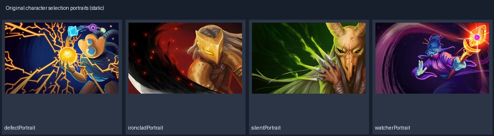

# 原版精选 · 人物与NPC

四个原版职业、角色选择图、商人和引导NPC占位，重点保留成套骨骼；主题不强行改写。

新增 [四职业透明战斗站姿 PNG](rendered-idle/README.md)：从已保留的 Spine 3.4.02 Idle 首帧组装导出，可直接用于 Unity Sprite；属于衍生导出，下面的 46 个源文件计数保持不变。

本类保留 46 个源文件，约 3.80 MiB。文件内容保留原样；整体来源见 [本批说明](../../Collections/sts-original/README.md)。

## 分组说明

| 分组 | 文件数 | 主要情况 |
|---|---:|---|
| [defect](defect/README.md) | 3 | 人物与NPC文件逐项规格/用途 |
| [defect/idle](defect/idle/README.md) | 3 | Spine 3.4.02，动作 Hit, Idle |
| [ironclad](ironclad/README.md) | 3 | 人物与NPC文件逐项规格/用途 |
| [ironclad/idle](ironclad/idle/README.md) | 3 | Spine 3.4.02，动作 Hit, Idle |
| [npcs/heart](npcs/heart/README.md) | 3 | Spine 3.4.02，动作 idle |
| [npcs/merchant](npcs/merchant/README.md) | 3 | Spine 3.4.02，动作 idle |
| [npcs/neow](npcs/neow/README.md) | 3 | Spine 3.4.02，动作 idle, speak |
| [selection](selection/README.md) | 10 | 人物与NPC文件逐项规格/用途 |
| [rendered-idle](rendered-idle/README.md) | 4张导出PNG | 四职业完整透明站姿，尺寸、用途与 Unity Pivot 见分组说明 |
| [theSilent](theSilent/README.md) | 3 | 人物与NPC文件逐项规格/用途 |
| [theSilent/idle](theSilent/idle/README.md) | 3 | Spine 3.4.02，动作 Hit, Idle |
| [watcher](watcher/README.md) | 3 | 人物与NPC文件逐项规格/用途 |
| [watcher/eye_anim](watcher/eye_anim/README.md) | 3 | Spine 3.4.02，动作 Calm, Divinity, None, Wrath |
| [watcher/idle](watcher/idle/README.md) | 3 | Spine 3.4.02，动作 Hit, Idle |

## 本类全部源文件索引

| 文件 | 实际规格 | 字节数 | 用途/配套关系 |
|---|---|---:|---|
| [defect/corpse.png](defect/corpse.png) | 512×512 P | 10650 | 倒地/死亡静态图 |
| [defect/idle/defect.png](defect/idle/defect.png) | 454×141 RGBA | 66775 | 骨骼图集贴图；不是完整角色独立立绘 |
| [defect/idle/skeleton.atlas](defect/idle/skeleton.atlas) | 图集索引；图片页 defect.png | 3212 | 图片页、区域与旋转/裁切索引；不可与贴图分离 |
| [defect/idle/skeleton.json](defect/idle/skeleton.json) | Spine 3.4.02 / 37骨骼 / 33槽位 | 92358 | 骨骼与动作数据；和同目录atlas及其图片页一起使用 |
| [defect/shoulder.png](defect/shoulder.png) | 1920×1136 P | 122589 | 角色肩部/局部姿态配件 |
| [defect/shoulder2.png](defect/shoulder2.png) | 1920×1136 P | 129625 | 角色肩部/局部姿态配件 |
| [ironclad/corpse.png](ironclad/corpse.png) | 512×512 P | 13122 | 倒地/死亡静态图 |
| [ironclad/idle/ironclad.png](ironclad/idle/ironclad.png) | 611×113 RGBA | 63096 | 骨骼图集贴图；不是完整角色独立立绘 |
| [ironclad/idle/skeleton.atlas](ironclad/idle/skeleton.atlas) | 图集索引；图片页 ironclad.png | 1806 | 图片页、区域与旋转/裁切索引；不可与贴图分离 |
| [ironclad/idle/skeleton.json](ironclad/idle/skeleton.json) | Spine 3.4.02 / 34骨骼 / 18槽位 | 101827 | 骨骼与动作数据；和同目录atlas及其图片页一起使用 |
| [ironclad/shoulder.png](ironclad/shoulder.png) | 1920×1136 P | 144177 | 角色肩部/局部姿态配件 |
| [ironclad/shoulder2.png](ironclad/shoulder2.png) | 1920×1136 P | 149926 | 角色肩部/局部姿态配件 |
| [theSilent/corpse.png](theSilent/corpse.png) | 512×512 P | 14077 | 倒地/死亡静态图 |
| [theSilent/idle/skeleton.atlas](theSilent/idle/skeleton.atlas) | 图集索引；图片页 theSilent.png | 1394 | 图片页、区域与旋转/裁切索引；不可与贴图分离 |
| [theSilent/idle/skeleton.json](theSilent/idle/skeleton.json) | Spine 3.4.02 / 28骨骼 / 14槽位 | 77447 | 骨骼与动作数据；和同目录atlas及其图片页一起使用 |
| [theSilent/idle/theSilent.png](theSilent/idle/theSilent.png) | 468×201 RGBA | 70494 | 骨骼图集贴图；不是完整角色独立立绘 |
| [theSilent/shoulder.png](theSilent/shoulder.png) | 1920×1136 P | 127322 | 角色肩部/局部姿态配件 |
| [theSilent/shoulder2.png](theSilent/shoulder2.png) | 1920×1136 P | 129068 | 角色肩部/局部姿态配件 |
| [watcher/corpse.png](watcher/corpse.png) | 512×512 P | 11089 | 倒地/死亡静态图 |
| [watcher/eye_anim/skeleton.atlas](watcher/eye_anim/skeleton.atlas) | 图集索引；图片页 the_watcher_eye.png | 643 | 图片页、区域与旋转/裁切索引；不可与贴图分离 |
| [watcher/eye_anim/skeleton.json](watcher/eye_anim/skeleton.json) | Spine 3.4.02 / 5骨骼 / 4槽位 | 12650 | 骨骼与动作数据；和同目录atlas及其图片页一起使用 |
| [watcher/eye_anim/the_watcher_eye.png](watcher/eye_anim/the_watcher_eye.png) | 256×32 RGBA | 6127 | 骨骼图集贴图；不是完整角色独立立绘 |
| [watcher/idle/skeleton.atlas](watcher/idle/skeleton.atlas) | 图集索引；图片页 the_watcher.png | 2799 | 图片页、区域与旋转/裁切索引；不可与贴图分离 |
| [watcher/idle/skeleton.json](watcher/idle/skeleton.json) | Spine 3.4.02 / 76骨骼 / 28槽位 | 135229 | 骨骼与动作数据；和同目录atlas及其图片页一起使用 |
| [watcher/idle/the_watcher.png](watcher/idle/the_watcher.png) | 1024×256 RGBA | 88833 | 骨骼图集贴图；不是完整角色独立立绘 |
| [watcher/shoulder.png](watcher/shoulder.png) | 1920×1136 P | 132741 | 角色肩部/局部姿态配件 |
| [watcher/shoulder2.png](watcher/shoulder2.png) | 1920×1136 P | 131936 | 角色肩部/局部姿态配件 |
| [npcs/heart/skeleton.atlas](npcs/heart/skeleton.atlas) | 图集索引；图片页 skeleton.png | 1247 | 图片页、区域与旋转/裁切索引；不可与贴图分离 |
| [npcs/heart/skeleton.json](npcs/heart/skeleton.json) | Spine 3.4.02 / 189骨骼 / 15槽位 | 197014 | 骨骼与动作数据；和同目录atlas及其图片页一起使用 |
| [npcs/heart/skeleton.png](npcs/heart/skeleton.png) | 1024×1024 RGBA | 419247 | 骨骼图集贴图；不是完整角色独立立绘 |
| [npcs/merchant/skeleton.atlas](npcs/merchant/skeleton.atlas) | 图集索引；图片页 skeleton.png | 679 | 图片页、区域与旋转/裁切索引；不可与贴图分离 |
| [npcs/merchant/skeleton.json](npcs/merchant/skeleton.json) | Spine 3.4.02 / 19骨骼 / 6槽位 | 13706 | 骨骼与动作数据；和同目录atlas及其图片页一起使用 |
| [npcs/merchant/skeleton.png](npcs/merchant/skeleton.png) | 256×256 RGBA | 46721 | 骨骼图集贴图；不是完整角色独立立绘 |
| [npcs/neow/skeleton.atlas](npcs/neow/skeleton.atlas) | 图集索引；图片页 skeleton.png | 800 | 图片页、区域与旋转/裁切索引；不可与贴图分离 |
| [npcs/neow/skeleton.json](npcs/neow/skeleton.json) | Spine 3.4.02 / 40骨骼 / 8槽位 | 98903 | 骨骼与动作数据；和同目录atlas及其图片页一起使用 |
| [npcs/neow/skeleton.png](npcs/neow/skeleton.png) | 1024×1024 RGBA | 336423 | 骨骼图集贴图；不是完整角色独立立绘 |
| [selection/defectButton.png](selection/defectButton.png) | 200×200 P | 9298 | 角色选择按钮/头像与选中态 |
| [selection/defectPortrait.jpg](selection/defectPortrait.jpg) | 1920×1200 RGB | 367634 | 角色选择插画/头像；可作静态原型占位 |
| [selection/highlightButton.png](selection/highlightButton.png) | 200×200 P | 1130 | 角色选择按钮/头像与选中态 |
| [selection/ironcladButton.png](selection/ironcladButton.png) | 200×200 P | 11127 | 角色选择按钮/头像与选中态 |
| [selection/ironcladPortrait.jpg](selection/ironcladPortrait.jpg) | 1920×1200 RGB | 144644 | 角色选择插画/头像；可作静态原型占位 |
| [selection/lockedButton.png](selection/lockedButton.png) | 200×200 P | 10678 | 角色选择按钮/头像与选中态 |
| [selection/silentButton.png](selection/silentButton.png) | 200×200 P | 10991 | 角色选择按钮/头像与选中态 |
| [selection/silentPortrait.jpg](selection/silentPortrait.jpg) | 1920×1200 RGB | 162806 | 角色选择插画/头像；可作静态原型占位 |
| [selection/watcherButton.png](selection/watcherButton.png) | 200×200 P | 12225 | 角色选择按钮/头像与选中态 |
| [selection/watcherPortrait.jpg](selection/watcherPortrait.jpg) | 1920×1200 RGB | 297426 | 角色选择插画/头像；可作静态原型占位 |
