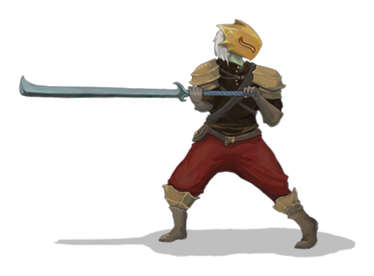
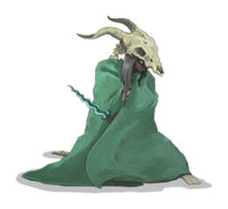
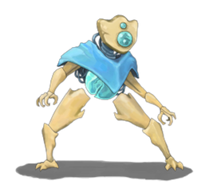
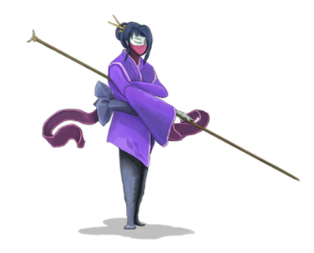

# STS1 四职业战斗站姿 · 透明 PNG

从仓库已保存的 STS1 Spine 3.4.02 `Idle` 骨骼、图集和贴图，按动作 **0.000 秒**渲染的二维静态图。保留服装、武器与原版脚下阴影；RGBA 透明背景。适合 Unity 战斗角色 Sprite、战斗站姿原型和角色选择界面的缩略图。它们不是三维模型，也不能替代骨骼动画。

| 素材 | 大小 | Unity Sprite 自定义 Pivot（左下角起，0–1） | 基本情况与用途 |
|---|---:|---:|---|
| [ironclad_idle.png](ironclad_idle.png) | 374×276 | (0.6310, 0.1341) | 铁甲战士持剑站姿；近战职业/玩家战斗单位。 |
| [theSilent_idle.png](theSilent_idle.png) | 283×259 | (0.5760, 0.1467) | 静默猎手披风与兽骨面具站姿；敏捷/毒系玩家战斗单位。 |
| [defect_idle.png](defect_idle.png) | 262×246 | (0.4924, 0.1463) | 故障机器人及胸部能量核心站姿；元素、闪电或充能系职业原型。 |
| [watcher_idle.png](watcher_idle.png) | 399×321 | (0.4261, 0.1059) | 观者持长杖站姿；姿态切换系玩家战斗单位。 |

## 导出说明

- 源文件分别位于相邻的 [ironclad/idle](../ironclad/idle/README.md)、[theSilent/idle](../theSilent/idle/README.md)、[defect/idle](../defect/idle/README.md)、[watcher/idle](../watcher/idle/README.md)；每组含 `skeleton.json`、`skeleton.atlas` 与图集 PNG。源文件没有被改动或复制。
- 使用与骨骼数据兼容的 Spine C 3.4 系列运行时计算 Idle 首帧的骨骼、IK、网格变形、绘制顺序和 UV；将各三角形从原图集采样，双倍采样后缩为上述像素尺寸。观者图中清理了一个与主体分离的微小图集杂点。运行时仅作离线导出工具，**未入库**。
- 每张图有约 16 px 的透明留白。Pivot 对应源骨骼坐标原点，故不是默认的中心点；若在 Unity 中想让四人站于同一地面基线，请先按表格设置 Custom Pivot，再调整 Sprite 的世界单位或 UI 缩放。建议纹理类型 `Sprite (2D and UI)`、保留 Alpha，过滤模式 `Bilinear`。
- 文件源自《杀戮尖塔》原版素材包，是用户的个人非商用学习/原型素材；**不标注为 CC0 或开源作品**。气象主题改造可从天气法杖、风暴核心、云纹披风等新绘制元素着手。

## 预览

 

 
