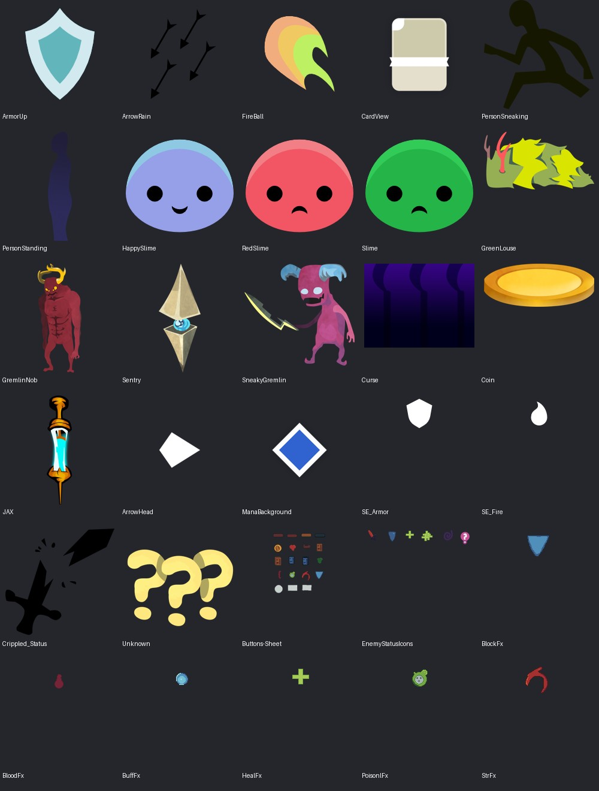
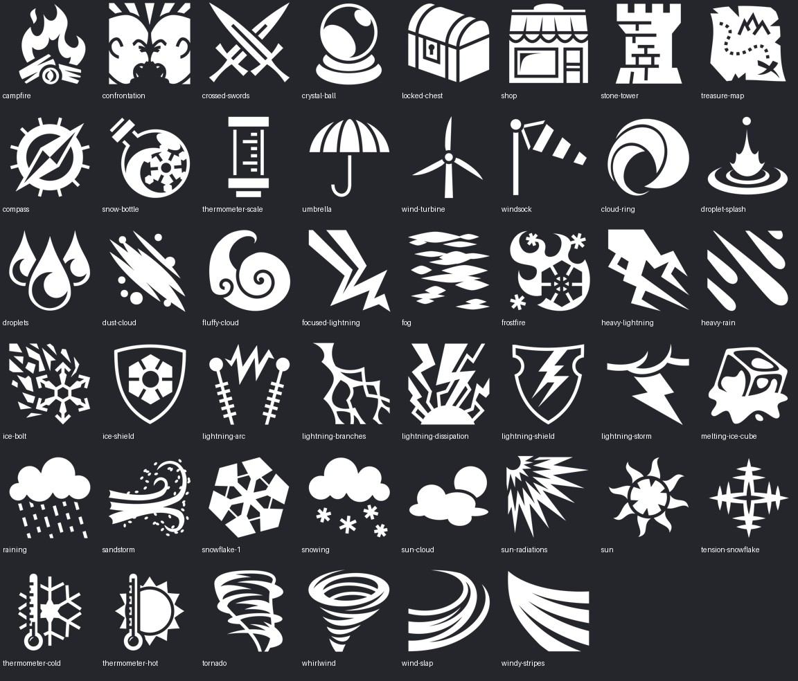

# 社区来源补充与黑金界面参考 · 2026-10-03

在现有素材库基础上补足可编辑模板、高清敌人静图、气象轮廓图标和卡牌拖尾参考。保存 107 个选用原文件/解包文件、46 张配套透明PNG，另保留 8 个未采用下载文件。没有三维模型。

新增内容包含 **四种HD怪物静态PNG、一份含矢量遮罩的绿虱PSD、六份可编辑卡面/遗物模板、46款SVG图标、六张单帧粒子贴图、教程二维素材与九张官方截图**。用户上传的长图按UI概念参考完整保存。

| 类别 | 原文件/解包文件数（含上游说明/许可） | 配套PNG | 入口 |
|---|---:|---:|---|
| ArtReferences | 10 | 0 | [dark-gold-concept](../../ArtReferences/dark-gold-concept/README.md) · [megacrit-presskit](../../ArtReferences/megacrit-presskit/README.md) |
| CardArt | 3 | 0 | [code-otter](../../CardArt/code-otter/README.md) |
| CardFrames | 6 | 0 | [code-otter](../../CardFrames/code-otter/README.md) · [gremious-hd](../../CardFrames/gremious-hd/README.md) |
| Characters | 2 | 0 | [gremious-hd](../../Characters/gremious-hd/README.md) |
| Enemies | 8 | 0 | [code-otter](../../Enemies/code-otter/README.md) · [gremious-hd](../../Enemies/gremious-hd/README.md) |
| EventBackgrounds | 1 | 0 | [gremious-hd](../../EventBackgrounds/gremious-hd/README.md) |
| Maps | 8 | 8 | [game-icons-fantasy](../../Maps/game-icons-fantasy/README.md) |
| Relics | 9 | 6 | [game-icons-fantasy](../../Relics/game-icons-fantasy/README.md) · [gremious-hd](../../Relics/gremious-hd/README.md) |
| Sources | 4 | 0 | [game-icons-fantasy](../../Sources/game-icons-fantasy/README.md) · [gremious-hd](../../Sources/gremious-hd/README.md) · [nue-deck](../../Sources/nue-deck/README.md) |
| UI | 8 | 0 | [code-otter](../../UI/code-otter/README.md) · [gremious-hd](../../UI/gremious-hd/README.md) · [nue-deck](../../UI/nue-deck/README.md) |
| VFX | 16 | 0 | [card-trail-godot](../../VFX/card-trail-godot/README.md) · [nue-deck](../../VFX/nue-deck/README.md) |
| WeatherIcons | 32 | 32 | [game-icons-fantasy](../../WeatherIcons/game-icons-fantasy/README.md) |

[废弃文件与未下载来源索引](../../Discarded/community-supplement-2026-10/README.md)：8个已下载占位素材保留原字节；远程未取用包只登记链接和原因。

## 推荐先用

1. [黑金长图阅读说明](../../ArtReferences/dark-gold-concept/README.md)：作为风格与界面布局方向。
2. [32款气象状态图标](../../WeatherIcons/game-icons-fantasy/README.md)，配套[6款气象遗物图标](../../Relics/game-icons-fantasy/README.md)和[8款地图节点图标](../../Maps/game-icons-fantasy/README.md)。
3. [HD敌人静图与绿虱可编辑源](../../Enemies/gremious-hd/README.md)：可先直接使用透明PNG。
4. [可编辑模板](../../CardFrames/gremious-hd/README.md)：打开图层，自行替换插画和颜色。
5. [卡牌拖尾代码/参数](../../VFX/card-trail-godot/README.md)：为Unity实现提供参考。

## 预览

[模板合成预览](../../Previews/community-supplement-2026-10/editable-templates.jpg) · [官方界面截图预览](../../Previews/community-supplement-2026-10/presskit.jpg)。空模板的空白/黑遮罩预览是源文件状态。

## 来源与验证

[本次推荐来源核对](SourceAudit.md) · [Unity取用与拖尾移植](UnityNotes.md) · [逐项来源、版本、大小和哈希](manifest.json) · [文件验证记录](validation.json)。

GitHub下载固定到提交SHA；普通Git文件与上游blob SHA核对，Nue Deck的LFS实体与指针SHA256/大小核对。MEGA通过公开分享解密，核对节点长度、文件解码和归档CRC，未实现MEGA传输MAC验证。PNG/SVG/PSD/7z检查不代表Unity集成：未导入Unity、未建立预制体、未验证动画或渲染；本批是素材仓库归档，尚非game-dev canonical package或vendor admit。
