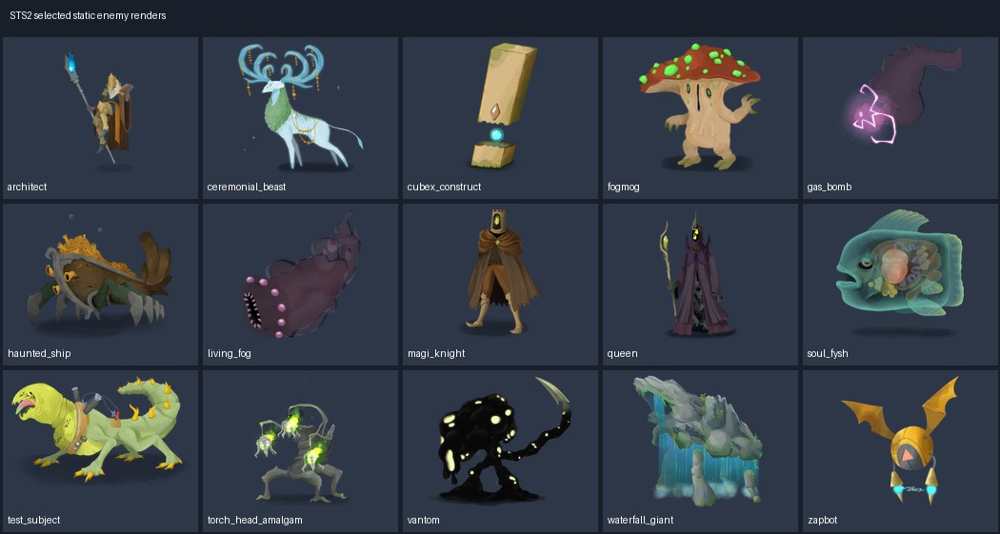

# Spire Codex · 二维敌人与Boss

来源为《Slay the Spire 2》主版本 v0.107.1 的站点导出图/预渲染结果。本类 112 项选用来源；[总说明](../../Collections/spire-codex-sts2/README.md)记录下载、来源与验证范围。

## animations/monsters/living_fog/attack.webp

| 资源/PNG入口 | 规格 | 用途 | 原下载与存档 |
|---|---|---|---|
| [monsters/living_fog/attack](animations/monsters/living_fog/attack/sheet_000.png) | 493×352 RGBA；30帧 / 1500ms / 2张图表 | attack：完整预渲染动作；按frames.json的帧序、矩形和时长播放 | [源WebP](https://cdn.spire-codex.com/game/v0.107.1/animations/monsters/living_fog/attack.webp) / [原文件ZIP](../../Sources/spire-codex-sts2/enemies-01.zip)（成员 `animations/monsters/living_fog/attack.webp`） |

### 动作 monsters/living_fog/attack.webp

完整帧数与原时长已保留；原文件loop值：`0`。一次性动作/游戏状态何时循环由项目定义，不因WebP循环标记就改变攻击行为。

| 配套文件 | 情况 |
|---|---|
| [sheet_000.png](animations/monsters/living_fog/attack/sheet_000.png) | animation_sheet / 1972×1760 / 1496918字节 |
| [sheet_001.png](animations/monsters/living_fog/attack/sheet_001.png) | animation_sheet / 1972×1056 / 737812字节 |
| [frames.json](animations/monsters/living_fog/attack/frames.json) | frame_metadata / 8863字节 |

## animations/monsters/zapbot/attack.webp

| 资源/PNG入口 | 规格 | 用途 | 原下载与存档 |
|---|---|---|---|
| [monsters/zapbot/attack](animations/monsters/zapbot/attack/sheet_000.png) | 273×318 RGBA；7帧 / 1250ms / 1张图表 | attack：完整预渲染动作；按frames.json的帧序、矩形和时长播放 | [源WebP](https://cdn.spire-codex.com/game/v0.107.1/animations/monsters/zapbot/attack.webp) / [原文件ZIP](../../Sources/spire-codex-sts2/enemies-01.zip)（成员 `animations/monsters/zapbot/attack.webp`） |

### 动作 monsters/zapbot/attack.webp

完整帧数与原时长已保留；原文件loop值：`0`。一次性动作/游戏状态何时循环由项目定义，不因WebP循环标记就改变攻击行为。

| 配套文件 | 情况 |
|---|---|
| [sheet_000.png](animations/monsters/zapbot/attack/sheet_000.png) | animation_sheet / 1911×318 / 122217字节 |
| [frames.json](animations/monsters/zapbot/attack/frames.json) | frame_metadata / 2348字节 |

## monsters

| 资源/PNG入口 | 规格 | 用途 | 原下载与存档 |
|---|---|---|---|
| [aeonglass](monsters/aeonglass.png) | 327×433 RGBA | aeonglass：已组装的完整静态二维外观，可直接作战斗Sprite；此静态文件本身无动画 | [源WebP](https://cdn.spire-codex.com/game/v0.107.1/monsters/aeonglass.webp) / [原文件ZIP](../../Sources/spire-codex-sts2/enemies-01.zip)（成员 `monsters/aeonglass.webp`） |
| [architect](monsters/architect.png) | 309×567 RGBA | architect：已组装的完整静态二维外观，可直接作战斗Sprite；此静态文件本身无动画 | [源WebP](https://cdn.spire-codex.com/game/v0.107.1/monsters/architect.webp) / [原文件ZIP](../../Sources/spire-codex-sts2/enemies-01.zip)（成员 `monsters/architect.webp`） |
| [assassin_ruby_raider](monsters/assassin_ruby_raider.png) | 232×285 RGBA | assassin_ruby_raider：已组装的完整静态二维外观，可直接作战斗Sprite；此静态文件本身无动画 | [源WebP](https://cdn.spire-codex.com/game/v0.107.1/monsters/assassin_ruby_raider.webp) / [原文件ZIP](../../Sources/spire-codex-sts2/enemies-01.zip)（成员 `monsters/assassin_ruby_raider.webp`） |
| [axe_ruby_raider](monsters/axe_ruby_raider.png) | 260×239 RGBA | axe_ruby_raider：已组装的完整静态二维外观，可直接作战斗Sprite；此静态文件本身无动画 | [源WebP](https://cdn.spire-codex.com/game/v0.107.1/monsters/axe_ruby_raider.webp) / [原文件ZIP](../../Sources/spire-codex-sts2/enemies-01.zip)（成员 `monsters/axe_ruby_raider.webp`） |
| [axebot](monsters/axebot.png) | 370×384 RGBA | axebot：已组装的完整静态二维外观，可直接作战斗Sprite；此静态文件本身无动画 | [源WebP](https://cdn.spire-codex.com/game/v0.107.1/monsters/axebot.webp) / [原文件ZIP](../../Sources/spire-codex-sts2/enemies-01.zip)（成员 `monsters/axebot.webp`） |
| [battle_friend_v1](monsters/battle_friend_v1.png) | 303×353 RGBA | battle_friend_v1：已组装的完整静态二维外观，可直接作战斗Sprite；此静态文件本身无动画 | [源WebP](https://cdn.spire-codex.com/game/v0.107.1/monsters/battle_friend_v1.webp) / [原文件ZIP](../../Sources/spire-codex-sts2/enemies-01.zip)（成员 `monsters/battle_friend_v1.webp`） |
| [battle_friend_v2](monsters/battle_friend_v2.png) | 384×355 RGBA | battle_friend_v2：已组装的完整静态二维外观，可直接作战斗Sprite；此静态文件本身无动画 | [源WebP](https://cdn.spire-codex.com/game/v0.107.1/monsters/battle_friend_v2.webp) / [原文件ZIP](../../Sources/spire-codex-sts2/enemies-01.zip)（成员 `monsters/battle_friend_v2.webp`） |
| [battle_friend_v3](monsters/battle_friend_v3.png) | 378×353 RGBA | battle_friend_v3：已组装的完整静态二维外观，可直接作战斗Sprite；此静态文件本身无动画 | [源WebP](https://cdn.spire-codex.com/game/v0.107.1/monsters/battle_friend_v3.webp) / [原文件ZIP](../../Sources/spire-codex-sts2/enemies-01.zip)（成员 `monsters/battle_friend_v3.webp`） |
| [bowlbug_egg](monsters/bowlbug_egg.png) | 164×133 RGBA | bowlbug_egg：已组装的完整静态二维外观，可直接作战斗Sprite；此静态文件本身无动画 | [源WebP](https://cdn.spire-codex.com/game/v0.107.1/monsters/bowlbug_egg.webp) / [原文件ZIP](../../Sources/spire-codex-sts2/enemies-01.zip)（成员 `monsters/bowlbug_egg.webp`） |
| [bowlbug_nectar](monsters/bowlbug_nectar.png) | 164×141 RGBA | bowlbug_nectar：已组装的完整静态二维外观，可直接作战斗Sprite；此静态文件本身无动画 | [源WebP](https://cdn.spire-codex.com/game/v0.107.1/monsters/bowlbug_nectar.webp) / [原文件ZIP](../../Sources/spire-codex-sts2/enemies-01.zip)（成员 `monsters/bowlbug_nectar.webp`） |
| [bowlbug_rock](monsters/bowlbug_rock.png) | 171×144 RGBA | bowlbug_rock：已组装的完整静态二维外观，可直接作战斗Sprite；此静态文件本身无动画 | [源WebP](https://cdn.spire-codex.com/game/v0.107.1/monsters/bowlbug_rock.webp) / [原文件ZIP](../../Sources/spire-codex-sts2/enemies-01.zip)（成员 `monsters/bowlbug_rock.webp`） |
| [bowlbug_silk](monsters/bowlbug_silk.png) | 177×144 RGBA | bowlbug_silk：已组装的完整静态二维外观，可直接作战斗Sprite；此静态文件本身无动画 | [源WebP](https://cdn.spire-codex.com/game/v0.107.1/monsters/bowlbug_silk.webp) / [原文件ZIP](../../Sources/spire-codex-sts2/enemies-01.zip)（成员 `monsters/bowlbug_silk.webp`） |
| [brute_ruby_raider](monsters/brute_ruby_raider.png) | 214×341 RGBA | brute_ruby_raider：已组装的完整静态二维外观，可直接作战斗Sprite；此静态文件本身无动画 | [源WebP](https://cdn.spire-codex.com/game/v0.107.1/monsters/brute_ruby_raider.webp) / [原文件ZIP](../../Sources/spire-codex-sts2/enemies-01.zip)（成员 `monsters/brute_ruby_raider.webp`） |
| [bygone_effigy](monsters/bygone_effigy.png) | 340×626 RGBA | bygone_effigy：已组装的完整静态二维外观，可直接作战斗Sprite；此静态文件本身无动画 | [源WebP](https://cdn.spire-codex.com/game/v0.107.1/monsters/bygone_effigy.webp) / [原文件ZIP](../../Sources/spire-codex-sts2/enemies-01.zip)（成员 `monsters/bygone_effigy.webp`） |
| [byrdonis](monsters/byrdonis.png) | 622×405 RGBA | byrdonis：已组装的完整静态二维外观，可直接作战斗Sprite；此静态文件本身无动画 | [源WebP](https://cdn.spire-codex.com/game/v0.107.1/monsters/byrdonis.webp) / [原文件ZIP](../../Sources/spire-codex-sts2/enemies-01.zip)（成员 `monsters/byrdonis.webp`） |
| [byrdpip](monsters/byrdpip.png) | 147×163 RGBA | byrdpip：已组装的完整静态二维外观，可直接作战斗Sprite；此静态文件本身无动画 | [源WebP](https://cdn.spire-codex.com/game/v0.107.1/monsters/byrdpip.webp) / [原文件ZIP](../../Sources/spire-codex-sts2/enemies-01.zip)（成员 `monsters/byrdpip.webp`） |
| [calcified_cultist](monsters/calcified_cultist.png) | 256×303 RGBA | calcified_cultist：已组装的完整静态二维外观，可直接作战斗Sprite；此静态文件本身无动画 | [源WebP](https://cdn.spire-codex.com/game/v0.107.1/monsters/calcified_cultist.webp) / [原文件ZIP](../../Sources/spire-codex-sts2/enemies-01.zip)（成员 `monsters/calcified_cultist.webp`） |
| [ceremonial_beast](monsters/ceremonial_beast.png) | 535×555 RGBA | ceremonial_beast：已组装的完整静态二维外观，可直接作战斗Sprite；此静态文件本身无动画 | [源WebP](https://cdn.spire-codex.com/game/v0.107.1/monsters/ceremonial_beast.webp) / [原文件ZIP](../../Sources/spire-codex-sts2/enemies-01.zip)（成员 `monsters/ceremonial_beast.webp`） |
| [chomper](monsters/chomper.png) | 220×124 RGBA | chomper：已组装的完整静态二维外观，可直接作战斗Sprite；此静态文件本身无动画 | [源WebP](https://cdn.spire-codex.com/game/v0.107.1/monsters/chomper.webp) / [原文件ZIP](../../Sources/spire-codex-sts2/enemies-01.zip)（成员 `monsters/chomper.webp`） |
| [corpse_slug](monsters/corpse_slug.png) | 215×141 RGBA | corpse_slug：已组装的完整静态二维外观，可直接作战斗Sprite；此静态文件本身无动画 | [源WebP](https://cdn.spire-codex.com/game/v0.107.1/monsters/corpse_slug.webp) / [原文件ZIP](../../Sources/spire-codex-sts2/enemies-01.zip)（成员 `monsters/corpse_slug.webp`） |
| [crossbow_ruby_raider](monsters/crossbow_ruby_raider.png) | 216×296 RGBA | crossbow_ruby_raider：已组装的完整静态二维外观，可直接作战斗Sprite；此静态文件本身无动画 | [源WebP](https://cdn.spire-codex.com/game/v0.107.1/monsters/crossbow_ruby_raider.webp) / [原文件ZIP](../../Sources/spire-codex-sts2/enemies-01.zip)（成员 `monsters/crossbow_ruby_raider.webp`） |
| [cubex_construct](monsters/cubex_construct.png) | 167×284 RGBA | cubex_construct：已组装的完整静态二维外观，可直接作战斗Sprite；此静态文件本身无动画 | [源WebP](https://cdn.spire-codex.com/game/v0.107.1/monsters/cubex_construct.webp) / [原文件ZIP](../../Sources/spire-codex-sts2/enemies-01.zip)（成员 `monsters/cubex_construct.webp`） |
| [damp_cultist](monsters/damp_cultist.png) | 252×332 RGBA | damp_cultist：已组装的完整静态二维外观，可直接作战斗Sprite；此静态文件本身无动画 | [源WebP](https://cdn.spire-codex.com/game/v0.107.1/monsters/damp_cultist.webp) / [原文件ZIP](../../Sources/spire-codex-sts2/enemies-01.zip)（成员 `monsters/damp_cultist.webp`） |
| [decimillipede_segment_back](monsters/decimillipede_segment_back.png) | 499×384 RGBA | decimillipede_segment_back：已组装的完整静态二维外观，可直接作战斗Sprite；此静态文件本身无动画 | [源WebP](https://cdn.spire-codex.com/game/v0.107.1/monsters/decimillipede_segment_back.webp) / [原文件ZIP](../../Sources/spire-codex-sts2/enemies-01.zip)（成员 `monsters/decimillipede_segment_back.webp`） |
| [decimillipede_segment_front](monsters/decimillipede_segment_front.png) | 1035×381 RGBA | decimillipede_segment_front：已组装的完整静态二维外观，可直接作战斗Sprite；此静态文件本身无动画 | [源WebP](https://cdn.spire-codex.com/game/v0.107.1/monsters/decimillipede_segment_front.webp) / [原文件ZIP](../../Sources/spire-codex-sts2/enemies-01.zip)（成员 `monsters/decimillipede_segment_front.webp`） |
| [decimillipede_segment_middle](monsters/decimillipede_segment_middle.png) | 415×215 RGBA | decimillipede_segment_middle：已组装的完整静态二维外观，可直接作战斗Sprite；此静态文件本身无动画 | [源WebP](https://cdn.spire-codex.com/game/v0.107.1/monsters/decimillipede_segment_middle.webp) / [原文件ZIP](../../Sources/spire-codex-sts2/enemies-01.zip)（成员 `monsters/decimillipede_segment_middle.webp`） |
| [devoted_sculptor](monsters/devoted_sculptor.png) | 290×405 RGBA | devoted_sculptor：已组装的完整静态二维外观，可直接作战斗Sprite；此静态文件本身无动画 | [源WebP](https://cdn.spire-codex.com/game/v0.107.1/monsters/devoted_sculptor.webp) / [原文件ZIP](../../Sources/spire-codex-sts2/enemies-01.zip)（成员 `monsters/devoted_sculptor.webp`） |
| [entomancer](monsters/entomancer.png) | 402×378 RGBA | entomancer：已组装的完整静态二维外观，可直接作战斗Sprite；此静态文件本身无动画 | [源WebP](https://cdn.spire-codex.com/game/v0.107.1/monsters/entomancer.webp) / [原文件ZIP](../../Sources/spire-codex-sts2/enemies-01.zip)（成员 `monsters/entomancer.webp`） |
| [exoskeleton](monsters/exoskeleton.png) | 160×151 RGBA | exoskeleton：已组装的完整静态二维外观，可直接作战斗Sprite；此静态文件本身无动画 | [源WebP](https://cdn.spire-codex.com/game/v0.107.1/monsters/exoskeleton.webp) / [原文件ZIP](../../Sources/spire-codex-sts2/enemies-01.zip)（成员 `monsters/exoskeleton.webp`） |
| [eye_with_teeth](monsters/eye_with_teeth.png) | 398×381 RGBA | eye_with_teeth：已组装的完整静态二维外观，可直接作战斗Sprite；此静态文件本身无动画 | [源WebP](https://cdn.spire-codex.com/game/v0.107.1/monsters/eye_with_teeth.webp) / [原文件ZIP](../../Sources/spire-codex-sts2/enemies-01.zip)（成员 `monsters/eye_with_teeth.webp`） |
| [fabricator](monsters/fabricator.png) | 548×404 RGBA | fabricator：已组装的完整静态二维外观，可直接作战斗Sprite；此静态文件本身无动画 | [源WebP](https://cdn.spire-codex.com/game/v0.107.1/monsters/fabricator.webp) / [原文件ZIP](../../Sources/spire-codex-sts2/enemies-01.zip)（成员 `monsters/fabricator.webp`） |
| [fake_merchant_monster](monsters/fake_merchant_monster.png) | 152×237 RGBA | fake_merchant_monster：已组装的完整静态二维外观，可直接作战斗Sprite；此静态文件本身无动画 | [源WebP](https://cdn.spire-codex.com/game/v0.107.1/monsters/fake_merchant_monster.webp) / [原文件ZIP](../../Sources/spire-codex-sts2/enemies-01.zip)（成员 `monsters/fake_merchant_monster.webp`） |
| [fat_gremlin](monsters/fat_gremlin.png) | 84×205 RGBA | fat_gremlin：已组装的完整静态二维外观，可直接作战斗Sprite；此静态文件本身无动画 | [源WebP](https://cdn.spire-codex.com/game/v0.107.1/monsters/fat_gremlin.webp) / [原文件ZIP](../../Sources/spire-codex-sts2/enemies-01.zip)（成员 `monsters/fat_gremlin.webp`） |
| [flail_knight](monsters/flail_knight.png) | 377×384 RGBA | flail_knight：已组装的完整静态二维外观，可直接作战斗Sprite；此静态文件本身无动画 | [源WebP](https://cdn.spire-codex.com/game/v0.107.1/monsters/flail_knight.webp) / [原文件ZIP](../../Sources/spire-codex-sts2/enemies-01.zip)（成员 `monsters/flail_knight.webp`） |
| [flyconid](monsters/flyconid.png) | 152×229 RGBA | flyconid：已组装的完整静态二维外观，可直接作战斗Sprite；此静态文件本身无动画 | [源WebP](https://cdn.spire-codex.com/game/v0.107.1/monsters/flyconid.webp) / [原文件ZIP](../../Sources/spire-codex-sts2/enemies-01.zip)（成员 `monsters/flyconid.webp`） |
| [fogmog](monsters/fogmog.png) | 212×224 RGBA | fogmog：已组装的完整静态二维外观，可直接作战斗Sprite；此静态文件本身无动画 | [源WebP](https://cdn.spire-codex.com/game/v0.107.1/monsters/fogmog.webp) / [原文件ZIP](../../Sources/spire-codex-sts2/enemies-01.zip)（成员 `monsters/fogmog.webp`） |
| [fossil_stalker](monsters/fossil_stalker.png) | 271×194 RGBA | fossil_stalker：已组装的完整静态二维外观，可直接作战斗Sprite；此静态文件本身无动画 | [源WebP](https://cdn.spire-codex.com/game/v0.107.1/monsters/fossil_stalker.webp) / [原文件ZIP](../../Sources/spire-codex-sts2/enemies-01.zip)（成员 `monsters/fossil_stalker.webp`） |
| [frog_knight](monsters/frog_knight.png) | 316×348 RGBA | frog_knight：已组装的完整静态二维外观，可直接作战斗Sprite；此静态文件本身无动画 | [源WebP](https://cdn.spire-codex.com/game/v0.107.1/monsters/frog_knight.webp) / [原文件ZIP](../../Sources/spire-codex-sts2/enemies-01.zip)（成员 `monsters/frog_knight.webp`） |
| [fuzzy_wurm_crawler](monsters/fuzzy_wurm_crawler.png) | 264×150 RGBA | fuzzy_wurm_crawler：已组装的完整静态二维外观，可直接作战斗Sprite；此静态文件本身无动画 | [源WebP](https://cdn.spire-codex.com/game/v0.107.1/monsters/fuzzy_wurm_crawler.webp) / [原文件ZIP](../../Sources/spire-codex-sts2/enemies-01.zip)（成员 `monsters/fuzzy_wurm_crawler.webp`） |
| [gas_bomb](monsters/gas_bomb.png) | 137×113 RGBA | gas_bomb：已组装的完整静态二维外观，可直接作战斗Sprite；此静态文件本身无动画 | [源WebP](https://cdn.spire-codex.com/game/v0.107.1/monsters/gas_bomb.webp) / [原文件ZIP](../../Sources/spire-codex-sts2/enemies-01.zip)（成员 `monsters/gas_bomb.webp`） |
| [globe_head](monsters/globe_head.png) | 186×301 RGBA | globe_head：已组装的完整静态二维外观，可直接作战斗Sprite；此静态文件本身无动画 | [源WebP](https://cdn.spire-codex.com/game/v0.107.1/monsters/globe_head.webp) / [原文件ZIP](../../Sources/spire-codex-sts2/enemies-01.zip)（成员 `monsters/globe_head.webp`） |
| [gremlin_merc](monsters/gremlin_merc.png) | 186×318 RGBA | gremlin_merc：已组装的完整静态二维外观，可直接作战斗Sprite；此静态文件本身无动画 | [源WebP](https://cdn.spire-codex.com/game/v0.107.1/monsters/gremlin_merc.webp) / [原文件ZIP](../../Sources/spire-codex-sts2/enemies-01.zip)（成员 `monsters/gremlin_merc.webp`） |
| [guardbot](monsters/guardbot.png) | 195×150 RGBA | guardbot：已组装的完整静态二维外观，可直接作战斗Sprite；此静态文件本身无动画 | [源WebP](https://cdn.spire-codex.com/game/v0.107.1/monsters/guardbot.webp) / [原文件ZIP](../../Sources/spire-codex-sts2/enemies-01.zip)（成员 `monsters/guardbot.webp`） |
| [haunted_ship](monsters/haunted_ship.png) | 602×543 RGBA | haunted_ship：已组装的完整静态二维外观，可直接作战斗Sprite；此静态文件本身无动画 | [源WebP](https://cdn.spire-codex.com/game/v0.107.1/monsters/haunted_ship.webp) / [原文件ZIP](../../Sources/spire-codex-sts2/enemies-01.zip)（成员 `monsters/haunted_ship.webp`） |
| [hunter_killer](monsters/hunter_killer.png) | 502×292 RGBA | hunter_killer：已组装的完整静态二维外观，可直接作战斗Sprite；此静态文件本身无动画 | [源WebP](https://cdn.spire-codex.com/game/v0.107.1/monsters/hunter_killer.webp) / [原文件ZIP](../../Sources/spire-codex-sts2/enemies-01.zip)（成员 `monsters/hunter_killer.webp`） |
| [infested_prism](monsters/infested_prism.png) | 210×358 RGBA | infested_prism：已组装的完整静态二维外观，可直接作战斗Sprite；此静态文件本身无动画 | [源WebP](https://cdn.spire-codex.com/game/v0.107.1/monsters/infested_prism.webp) / [原文件ZIP](../../Sources/spire-codex-sts2/enemies-01.zip)（成员 `monsters/infested_prism.webp`） |
| [inklet](monsters/inklet.png) | 106×177 RGBA | inklet：已组装的完整静态二维外观，可直接作战斗Sprite；此静态文件本身无动画 | [源WebP](https://cdn.spire-codex.com/game/v0.107.1/monsters/inklet.webp) / [原文件ZIP](../../Sources/spire-codex-sts2/enemies-01.zip)（成员 `monsters/inklet.webp`） |
| [kin_follower](monsters/kin_follower.png) | 233×191 RGBA | kin_follower：已组装的完整静态二维外观，可直接作战斗Sprite；此静态文件本身无动画 | [源WebP](https://cdn.spire-codex.com/game/v0.107.1/monsters/kin_follower.webp) / [原文件ZIP](../../Sources/spire-codex-sts2/enemies-01.zip)（成员 `monsters/kin_follower.webp`） |
| [kin_priest](monsters/kin_priest.png) | 395×345 RGBA | kin_priest：已组装的完整静态二维外观，可直接作战斗Sprite；此静态文件本身无动画 | [源WebP](https://cdn.spire-codex.com/game/v0.107.1/monsters/kin_priest.webp) / [原文件ZIP](../../Sources/spire-codex-sts2/enemies-01.zip)（成员 `monsters/kin_priest.webp`） |
| [knowledge_demon](monsters/knowledge_demon.png) | 538×638 RGBA | knowledge_demon：已组装的完整静态二维外观，可直接作战斗Sprite；此静态文件本身无动画 | [源WebP](https://cdn.spire-codex.com/game/v0.107.1/monsters/knowledge_demon.webp) / [原文件ZIP](../../Sources/spire-codex-sts2/enemies-01.zip)（成员 `monsters/knowledge_demon.webp`） |
| [lagavulin_matriarch](monsters/lagavulin_matriarch.png) | 725×546 RGBA | lagavulin_matriarch：已组装的完整静态二维外观，可直接作战斗Sprite；此静态文件本身无动画 | [源WebP](https://cdn.spire-codex.com/game/v0.107.1/monsters/lagavulin_matriarch.webp) / [原文件ZIP](../../Sources/spire-codex-sts2/enemies-01.zip)（成员 `monsters/lagavulin_matriarch.webp`） |
| [leaf_slime_m](monsters/leaf_slime_m.png) | 163×121 RGBA | leaf_slime_m：已组装的完整静态二维外观，可直接作战斗Sprite；此静态文件本身无动画 | [源WebP](https://cdn.spire-codex.com/game/v0.107.1/monsters/leaf_slime_m.webp) / [原文件ZIP](../../Sources/spire-codex-sts2/enemies-01.zip)（成员 `monsters/leaf_slime_m.webp`） |
| [leaf_slime_s](monsters/leaf_slime_s.png) | 98×75 RGBA | leaf_slime_s：已组装的完整静态二维外观，可直接作战斗Sprite；此静态文件本身无动画 | [源WebP](https://cdn.spire-codex.com/game/v0.107.1/monsters/leaf_slime_s.webp) / [原文件ZIP](../../Sources/spire-codex-sts2/enemies-01.zip)（成员 `monsters/leaf_slime_s.webp`） |
| [living_fog](monsters/living_fog.png) | 303×323 RGBA | living_fog：已组装的完整静态二维外观，可直接作战斗Sprite；此静态文件本身无动画 | [源WebP](https://cdn.spire-codex.com/game/v0.107.1/monsters/living_fog.webp) / [原文件ZIP](../../Sources/spire-codex-sts2/enemies-01.zip)（成员 `monsters/living_fog.webp`） |
| [living_shield](monsters/living_shield.png) | 352×413 RGBA | living_shield：已组装的完整静态二维外观，可直接作战斗Sprite；此静态文件本身无动画 | [源WebP](https://cdn.spire-codex.com/game/v0.107.1/monsters/living_shield.webp) / [原文件ZIP](../../Sources/spire-codex-sts2/enemies-01.zip)（成员 `monsters/living_shield.webp`） |
| [louse_progenitor](monsters/louse_progenitor.png) | 541×356 RGBA | louse_progenitor：已组装的完整静态二维外观，可直接作战斗Sprite；此静态文件本身无动画 | [源WebP](https://cdn.spire-codex.com/game/v0.107.1/monsters/louse_progenitor.webp) / [原文件ZIP](../../Sources/spire-codex-sts2/enemies-01.zip)（成员 `monsters/louse_progenitor.webp`） |
| [magi_knight](monsters/magi_knight.png) | 215×324 RGBA | magi_knight：已组装的完整静态二维外观，可直接作战斗Sprite；此静态文件本身无动画 | [源WebP](https://cdn.spire-codex.com/game/v0.107.1/monsters/magi_knight.webp) / [原文件ZIP](../../Sources/spire-codex-sts2/enemies-01.zip)（成员 `monsters/magi_knight.webp`） |
| [mawler](monsters/mawler.png) | 531×286 RGBA | mawler：已组装的完整静态二维外观，可直接作战斗Sprite；此静态文件本身无动画 | [源WebP](https://cdn.spire-codex.com/game/v0.107.1/monsters/mawler.webp) / [原文件ZIP](../../Sources/spire-codex-sts2/enemies-01.zip)（成员 `monsters/mawler.webp`） |
| [mecha_knight](monsters/mecha_knight.png) | 584×596 RGBA | mecha_knight：已组装的完整静态二维外观，可直接作战斗Sprite；此静态文件本身无动画 | [源WebP](https://cdn.spire-codex.com/game/v0.107.1/monsters/mecha_knight.webp) / [原文件ZIP](../../Sources/spire-codex-sts2/enemies-01.zip)（成员 `monsters/mecha_knight.webp`） |
| [mysterious_knight](monsters/mysterious_knight.png) | 470×465 RGBA | mysterious_knight：已组装的完整静态二维外观，可直接作战斗Sprite；此静态文件本身无动画 | [源WebP](https://cdn.spire-codex.com/game/v0.107.1/monsters/mysterious_knight.webp) / [原文件ZIP](../../Sources/spire-codex-sts2/enemies-01.zip)（成员 `monsters/mysterious_knight.webp`） |
| [myte](monsters/myte.png) | 312×251 RGBA | myte：已组装的完整静态二维外观，可直接作战斗Sprite；此静态文件本身无动画 | [源WebP](https://cdn.spire-codex.com/game/v0.107.1/monsters/myte.webp) / [原文件ZIP](../../Sources/spire-codex-sts2/enemies-01.zip)（成员 `monsters/myte.webp`） |
| [nibbit](monsters/nibbit.png) | 246×122 RGBA | nibbit：已组装的完整静态二维外观，可直接作战斗Sprite；此静态文件本身无动画 | [源WebP](https://cdn.spire-codex.com/game/v0.107.1/monsters/nibbit.webp) / [原文件ZIP](../../Sources/spire-codex-sts2/enemies-01.zip)（成员 `monsters/nibbit.webp`） |
| [noisebot](monsters/noisebot.png) | 192×149 RGBA | noisebot：已组装的完整静态二维外观，可直接作战斗Sprite；此静态文件本身无动画 | [源WebP](https://cdn.spire-codex.com/game/v0.107.1/monsters/noisebot.webp) / [原文件ZIP](../../Sources/spire-codex-sts2/enemies-01.zip)（成员 `monsters/noisebot.webp`） |
| [osty](monsters/osty.png) | 223×229 RGBA | osty：已组装的完整静态二维外观，可直接作战斗Sprite；此静态文件本身无动画 | [源WebP](https://cdn.spire-codex.com/game/v0.107.1/monsters/osty.webp) / [原文件ZIP](../../Sources/spire-codex-sts2/enemies-01.zip)（成员 `monsters/osty.webp`） |
| [ovicopter](monsters/ovicopter.png) | 414×477 RGBA | ovicopter：已组装的完整静态二维外观，可直接作战斗Sprite；此静态文件本身无动画 | [源WebP](https://cdn.spire-codex.com/game/v0.107.1/monsters/ovicopter.webp) / [原文件ZIP](../../Sources/spire-codex-sts2/enemies-01.zip)（成员 `monsters/ovicopter.webp`） |
| [owl_magistrate](monsters/owl_magistrate.png) | 490×377 RGBA | owl_magistrate：已组装的完整静态二维外观，可直接作战斗Sprite；此静态文件本身无动画 | [源WebP](https://cdn.spire-codex.com/game/v0.107.1/monsters/owl_magistrate.webp) / [原文件ZIP](../../Sources/spire-codex-sts2/enemies-01.zip)（成员 `monsters/owl_magistrate.webp`） |
| [paels_legion](monsters/paels_legion.png) | 124×93 RGBA | paels_legion：已组装的完整静态二维外观，可直接作战斗Sprite；此静态文件本身无动画 | [源WebP](https://cdn.spire-codex.com/game/v0.107.1/monsters/paels_legion.webp) / [原文件ZIP](../../Sources/spire-codex-sts2/enemies-01.zip)（成员 `monsters/paels_legion.webp`） |
| [parafright](monsters/parafright.png) | 329×336 RGBA | parafright：已组装的完整静态二维外观，可直接作战斗Sprite；此静态文件本身无动画 | [源WebP](https://cdn.spire-codex.com/game/v0.107.1/monsters/parafright.webp) / [原文件ZIP](../../Sources/spire-codex-sts2/enemies-01.zip)（成员 `monsters/parafright.webp`） |
| [phrog_parasite](monsters/phrog_parasite.png) | 473×480 RGBA | phrog_parasite：已组装的完整静态二维外观，可直接作战斗Sprite；此静态文件本身无动画 | [源WebP](https://cdn.spire-codex.com/game/v0.107.1/monsters/phrog_parasite.webp) / [原文件ZIP](../../Sources/spire-codex-sts2/enemies-01.zip)（成员 `monsters/phrog_parasite.webp`） |
| [punch_construct](monsters/punch_construct.png) | 234×321 RGBA | punch_construct：已组装的完整静态二维外观，可直接作战斗Sprite；此静态文件本身无动画 | [源WebP](https://cdn.spire-codex.com/game/v0.107.1/monsters/punch_construct.webp) / [原文件ZIP](../../Sources/spire-codex-sts2/enemies-01.zip)（成员 `monsters/punch_construct.webp`） |
| [queen](monsters/queen.png) | 327×531 RGBA | queen：已组装的完整静态二维外观，可直接作战斗Sprite；此静态文件本身无动画 | [源WebP](https://cdn.spire-codex.com/game/v0.107.1/monsters/queen.webp) / [原文件ZIP](../../Sources/spire-codex-sts2/enemies-01.zip)（成员 `monsters/queen.webp`） |
| [scroll_of_biting](monsters/scroll_of_biting.png) | 151×158 RGBA | scroll_of_biting：已组装的完整静态二维外观，可直接作战斗Sprite；此静态文件本身无动画 | [源WebP](https://cdn.spire-codex.com/game/v0.107.1/monsters/scroll_of_biting.webp) / [原文件ZIP](../../Sources/spire-codex-sts2/enemies-01.zip)（成员 `monsters/scroll_of_biting.webp`） |
| [seapunk](monsters/seapunk.png) | 306×251 RGBA | seapunk：已组装的完整静态二维外观，可直接作战斗Sprite；此静态文件本身无动画 | [源WebP](https://cdn.spire-codex.com/game/v0.107.1/monsters/seapunk.webp) / [原文件ZIP](../../Sources/spire-codex-sts2/enemies-01.zip)（成员 `monsters/seapunk.webp`） |
| [sewer_clam](monsters/sewer_clam.png) | 257×242 RGBA | sewer_clam：已组装的完整静态二维外观，可直接作战斗Sprite；此静态文件本身无动画 | [源WebP](https://cdn.spire-codex.com/game/v0.107.1/monsters/sewer_clam.webp) / [原文件ZIP](../../Sources/spire-codex-sts2/enemies-01.zip)（成员 `monsters/sewer_clam.webp`） |
| [shrinker_beetle](monsters/shrinker_beetle.png) | 213×169 RGBA | shrinker_beetle：已组装的完整静态二维外观，可直接作战斗Sprite；此静态文件本身无动画 | [源WebP](https://cdn.spire-codex.com/game/v0.107.1/monsters/shrinker_beetle.webp) / [原文件ZIP](../../Sources/spire-codex-sts2/enemies-01.zip)（成员 `monsters/shrinker_beetle.webp`） |
| [skulking_colony](monsters/skulking_colony.png) | 356×427 RGBA | skulking_colony：已组装的完整静态二维外观，可直接作战斗Sprite；此静态文件本身无动画 | [源WebP](https://cdn.spire-codex.com/game/v0.107.1/monsters/skulking_colony.webp) / [原文件ZIP](../../Sources/spire-codex-sts2/enemies-01.zip)（成员 `monsters/skulking_colony.webp`） |
| [slimed_berserker](monsters/slimed_berserker.png) | 632×337 RGBA | slimed_berserker：已组装的完整静态二维外观，可直接作战斗Sprite；此静态文件本身无动画 | [源WebP](https://cdn.spire-codex.com/game/v0.107.1/monsters/slimed_berserker.webp) / [原文件ZIP](../../Sources/spire-codex-sts2/enemies-01.zip)（成员 `monsters/slimed_berserker.webp`） |
| [slithering_strangler](monsters/slithering_strangler.png) | 153×199 RGBA | slithering_strangler：已组装的完整静态二维外观，可直接作战斗Sprite；此静态文件本身无动画 | [源WebP](https://cdn.spire-codex.com/game/v0.107.1/monsters/slithering_strangler.webp) / [原文件ZIP](../../Sources/spire-codex-sts2/enemies-01.zip)（成员 `monsters/slithering_strangler.webp`） |
| [sludge_spinner](monsters/sludge_spinner.png) | 157×233 RGBA | sludge_spinner：已组装的完整静态二维外观，可直接作战斗Sprite；此静态文件本身无动画 | [源WebP](https://cdn.spire-codex.com/game/v0.107.1/monsters/sludge_spinner.webp) / [原文件ZIP](../../Sources/spire-codex-sts2/enemies-01.zip)（成员 `monsters/sludge_spinner.webp`） |
| [slumbering_beetle](monsters/slumbering_beetle.png) | 715×363 RGBA | slumbering_beetle：已组装的完整静态二维外观，可直接作战斗Sprite；此静态文件本身无动画 | [源WebP](https://cdn.spire-codex.com/game/v0.107.1/monsters/slumbering_beetle.webp) / [原文件ZIP](../../Sources/spire-codex-sts2/enemies-01.zip)（成员 `monsters/slumbering_beetle.webp`） |
| [snapping_jaxfruit](monsters/snapping_jaxfruit.png) | 191×254 RGBA | snapping_jaxfruit：已组装的完整静态二维外观，可直接作战斗Sprite；此静态文件本身无动画 | [源WebP](https://cdn.spire-codex.com/game/v0.107.1/monsters/snapping_jaxfruit.webp) / [原文件ZIP](../../Sources/spire-codex-sts2/enemies-01.zip)（成员 `monsters/snapping_jaxfruit.webp`） |
| [sneaky_gremlin](monsters/sneaky_gremlin.png) | 170×142 RGBA | sneaky_gremlin：已组装的完整静态二维外观，可直接作战斗Sprite；此静态文件本身无动画 | [源WebP](https://cdn.spire-codex.com/game/v0.107.1/monsters/sneaky_gremlin.webp) / [原文件ZIP](../../Sources/spire-codex-sts2/enemies-01.zip)（成员 `monsters/sneaky_gremlin.webp`） |
| [soul_fysh](monsters/soul_fysh.png) | 438×449 RGBA | soul_fysh：已组装的完整静态二维外观，可直接作战斗Sprite；此静态文件本身无动画 | [源WebP](https://cdn.spire-codex.com/game/v0.107.1/monsters/soul_fysh.webp) / [原文件ZIP](../../Sources/spire-codex-sts2/enemies-01.zip)（成员 `monsters/soul_fysh.webp`） |
| [soul_nexus](monsters/soul_nexus.png) | 594×689 RGBA | soul_nexus：已组装的完整静态二维外观，可直接作战斗Sprite；此静态文件本身无动画 | [源WebP](https://cdn.spire-codex.com/game/v0.107.1/monsters/soul_nexus.webp) / [原文件ZIP](../../Sources/spire-codex-sts2/enemies-01.zip)（成员 `monsters/soul_nexus.webp`） |
| [spectral_knight](monsters/spectral_knight.png) | 350×353 RGBA | spectral_knight：已组装的完整静态二维外观，可直接作战斗Sprite；此静态文件本身无动画 | [源WebP](https://cdn.spire-codex.com/game/v0.107.1/monsters/spectral_knight.webp) / [原文件ZIP](../../Sources/spire-codex-sts2/enemies-01.zip)（成员 `monsters/spectral_knight.webp`） |
| [spiny_toad](monsters/spiny_toad.png) | 549×412 RGBA | spiny_toad：已组装的完整静态二维外观，可直接作战斗Sprite；此静态文件本身无动画 | [源WebP](https://cdn.spire-codex.com/game/v0.107.1/monsters/spiny_toad.webp) / [原文件ZIP](../../Sources/spire-codex-sts2/enemies-01.zip)（成员 `monsters/spiny_toad.webp`） |
| [stabbot](monsters/stabbot.png) | 215×177 RGBA | stabbot：已组装的完整静态二维外观，可直接作战斗Sprite；此静态文件本身无动画 | [源WebP](https://cdn.spire-codex.com/game/v0.107.1/monsters/stabbot.webp) / [原文件ZIP](../../Sources/spire-codex-sts2/enemies-01.zip)（成员 `monsters/stabbot.webp`） |
| [terror_eel](monsters/terror_eel.png) | 654×287 RGBA | terror_eel：已组装的完整静态二维外观，可直接作战斗Sprite；此静态文件本身无动画 | [源WebP](https://cdn.spire-codex.com/game/v0.107.1/monsters/terror_eel.webp) / [原文件ZIP](../../Sources/spire-codex-sts2/enemies-02.zip)（成员 `monsters/terror_eel.webp`） |
| [test_subject](monsters/test_subject.png) | 430×260 RGBA | test_subject：已组装的完整静态二维外观，可直接作战斗Sprite；此静态文件本身无动画 | [源WebP](https://cdn.spire-codex.com/game/v0.107.1/monsters/test_subject.webp) / [原文件ZIP](../../Sources/spire-codex-sts2/enemies-02.zip)（成员 `monsters/test_subject.webp`） |
| [the_adversary_mk_one](monsters/the_adversary_mk_one.png) | 449×486 RGBA | the_adversary_mk_one：已组装的完整静态二维外观，可直接作战斗Sprite；此静态文件本身无动画 | [源WebP](https://cdn.spire-codex.com/game/v0.107.1/monsters/the_adversary_mk_one.webp) / [原文件ZIP](../../Sources/spire-codex-sts2/enemies-02.zip)（成员 `monsters/the_adversary_mk_one.webp`） |
| [the_adversary_mk_three](monsters/the_adversary_mk_three.png) | 449×486 RGBA | the_adversary_mk_three：已组装的完整静态二维外观，可直接作战斗Sprite；此静态文件本身无动画 | [源WebP](https://cdn.spire-codex.com/game/v0.107.1/monsters/the_adversary_mk_three.webp) / [原文件ZIP](../../Sources/spire-codex-sts2/enemies-02.zip)（成员 `monsters/the_adversary_mk_three.webp`） |
| [the_adversary_mk_two](monsters/the_adversary_mk_two.png) | 449×486 RGBA | the_adversary_mk_two：已组装的完整静态二维外观，可直接作战斗Sprite；此静态文件本身无动画 | [源WebP](https://cdn.spire-codex.com/game/v0.107.1/monsters/the_adversary_mk_two.webp) / [原文件ZIP](../../Sources/spire-codex-sts2/enemies-02.zip)（成员 `monsters/the_adversary_mk_two.webp`） |
| [the_forgotten](monsters/the_forgotten.png) | 274×347 RGBA | the_forgotten：已组装的完整静态二维外观，可直接作战斗Sprite；此静态文件本身无动画 | [源WebP](https://cdn.spire-codex.com/game/v0.107.1/monsters/the_forgotten.webp) / [原文件ZIP](../../Sources/spire-codex-sts2/enemies-02.zip)（成员 `monsters/the_forgotten.webp`） |
| [the_insatiable](monsters/the_insatiable.png) | 573×469 RGBA | the_insatiable：已组装的完整静态二维外观，可直接作战斗Sprite；此静态文件本身无动画 | [源WebP](https://cdn.spire-codex.com/game/v0.107.1/monsters/the_insatiable.webp) / [原文件ZIP](../../Sources/spire-codex-sts2/enemies-02.zip)（成员 `monsters/the_insatiable.webp`） |
| [the_lost](monsters/the_lost.png) | 215×377 RGBA | the_lost：已组装的完整静态二维外观，可直接作战斗Sprite；此静态文件本身无动画 | [源WebP](https://cdn.spire-codex.com/game/v0.107.1/monsters/the_lost.webp) / [原文件ZIP](../../Sources/spire-codex-sts2/enemies-02.zip)（成员 `monsters/the_lost.webp`） |
| [the_obscura](monsters/the_obscura.png) | 391×286 RGBA | the_obscura：已组装的完整静态二维外观，可直接作战斗Sprite；此静态文件本身无动画 | [源WebP](https://cdn.spire-codex.com/game/v0.107.1/monsters/the_obscura.webp) / [原文件ZIP](../../Sources/spire-codex-sts2/enemies-02.zip)（成员 `monsters/the_obscura.webp`） |
| [thieving_hopper](monsters/thieving_hopper.png) | 262×298 RGBA | thieving_hopper：已组装的完整静态二维外观，可直接作战斗Sprite；此静态文件本身无动画 | [源WebP](https://cdn.spire-codex.com/game/v0.107.1/monsters/thieving_hopper.webp) / [原文件ZIP](../../Sources/spire-codex-sts2/enemies-02.zip)（成员 `monsters/thieving_hopper.webp`） |
| [toadpole](monsters/toadpole.png) | 228×143 RGBA | toadpole：已组装的完整静态二维外观，可直接作战斗Sprite；此静态文件本身无动画 | [源WebP](https://cdn.spire-codex.com/game/v0.107.1/monsters/toadpole.webp) / [原文件ZIP](../../Sources/spire-codex-sts2/enemies-02.zip)（成员 `monsters/toadpole.webp`） |
| [torch_head_amalgam](monsters/torch_head_amalgam.png) | 325×410 RGBA | torch_head_amalgam：已组装的完整静态二维外观，可直接作战斗Sprite；此静态文件本身无动画 | [源WebP](https://cdn.spire-codex.com/game/v0.107.1/monsters/torch_head_amalgam.webp) / [原文件ZIP](../../Sources/spire-codex-sts2/enemies-02.zip)（成员 `monsters/torch_head_amalgam.webp`） |
| [tracker_ruby_raider](monsters/tracker_ruby_raider.png) | 292×228 RGBA | tracker_ruby_raider：已组装的完整静态二维外观，可直接作战斗Sprite；此静态文件本身无动画 | [源WebP](https://cdn.spire-codex.com/game/v0.107.1/monsters/tracker_ruby_raider.webp) / [原文件ZIP](../../Sources/spire-codex-sts2/enemies-02.zip)（成员 `monsters/tracker_ruby_raider.webp`） |
| [tunneler](monsters/tunneler.png) | 245×204 RGBA | tunneler：已组装的完整静态二维外观，可直接作战斗Sprite；此静态文件本身无动画 | [源WebP](https://cdn.spire-codex.com/game/v0.107.1/monsters/tunneler.webp) / [原文件ZIP](../../Sources/spire-codex-sts2/enemies-02.zip)（成员 `monsters/tunneler.webp`） |
| [turret_operator](monsters/turret_operator.png) | 273×219 RGBA | turret_operator：已组装的完整静态二维外观，可直接作战斗Sprite；此静态文件本身无动画 | [源WebP](https://cdn.spire-codex.com/game/v0.107.1/monsters/turret_operator.webp) / [原文件ZIP](../../Sources/spire-codex-sts2/enemies-02.zip)（成员 `monsters/turret_operator.webp`） |
| [twig_slime_m](monsters/twig_slime_m.png) | 185×160 RGBA | twig_slime_m：已组装的完整静态二维外观，可直接作战斗Sprite；此静态文件本身无动画 | [源WebP](https://cdn.spire-codex.com/game/v0.107.1/monsters/twig_slime_m.webp) / [原文件ZIP](../../Sources/spire-codex-sts2/enemies-02.zip)（成员 `monsters/twig_slime_m.webp`） |
| [twig_slime_s](monsters/twig_slime_s.png) | 114×93 RGBA | twig_slime_s：已组装的完整静态二维外观，可直接作战斗Sprite；此静态文件本身无动画 | [源WebP](https://cdn.spire-codex.com/game/v0.107.1/monsters/twig_slime_s.webp) / [原文件ZIP](../../Sources/spire-codex-sts2/enemies-02.zip)（成员 `monsters/twig_slime_s.webp`） |
| [two_tailed_rat](monsters/two_tailed_rat.png) | 285×210 RGBA | two_tailed_rat：已组装的完整静态二维外观，可直接作战斗Sprite；此静态文件本身无动画 | [源WebP](https://cdn.spire-codex.com/game/v0.107.1/monsters/two_tailed_rat.webp) / [原文件ZIP](../../Sources/spire-codex-sts2/enemies-02.zip)（成员 `monsters/two_tailed_rat.webp`） |
| [vantom](monsters/vantom.png) | 488×442 RGBA | vantom：已组装的完整静态二维外观，可直接作战斗Sprite；此静态文件本身无动画 | [源WebP](https://cdn.spire-codex.com/game/v0.107.1/monsters/vantom.webp) / [原文件ZIP](../../Sources/spire-codex-sts2/enemies-02.zip)（成员 `monsters/vantom.webp`） |
| [vine_shambler](monsters/vine_shambler.png) | 425×330 RGBA | vine_shambler：已组装的完整静态二维外观，可直接作战斗Sprite；此静态文件本身无动画 | [源WebP](https://cdn.spire-codex.com/game/v0.107.1/monsters/vine_shambler.webp) / [原文件ZIP](../../Sources/spire-codex-sts2/enemies-02.zip)（成员 `monsters/vine_shambler.webp`） |
| [waterfall_giant](monsters/waterfall_giant.png) | 518×512 RGBA | waterfall_giant：已组装的完整静态二维外观，可直接作战斗Sprite；此静态文件本身无动画 | [源WebP](https://cdn.spire-codex.com/game/v0.107.1/monsters/waterfall_giant.webp) / [原文件ZIP](../../Sources/spire-codex-sts2/enemies-02.zip)（成员 `monsters/waterfall_giant.webp`） |
| [wriggler](monsters/wriggler.png) | 175×174 RGBA | wriggler：已组装的完整静态二维外观，可直接作战斗Sprite；此静态文件本身无动画 | [源WebP](https://cdn.spire-codex.com/game/v0.107.1/monsters/wriggler.webp) / [原文件ZIP](../../Sources/spire-codex-sts2/enemies-02.zip)（成员 `monsters/wriggler.webp`） |
| [zapbot](monsters/zapbot.png) | 190×209 RGBA | zapbot：已组装的完整静态二维外观，可直接作战斗Sprite；此静态文件本身无动画 | [源WebP](https://cdn.spire-codex.com/game/v0.107.1/monsters/zapbot.webp) / [原文件ZIP](../../Sources/spire-codex-sts2/enemies-02.zip)（成员 `monsters/zapbot.webp`） |

PNG转换保留源WebP解码后的RGBA像素与透明度。图表与单张PNG均已读取检查，Unity尚未导入运行。原SHA256、图表坐标与取舍记录见[清单](../../Collections/spire-codex-sts2/manifest.json)。
