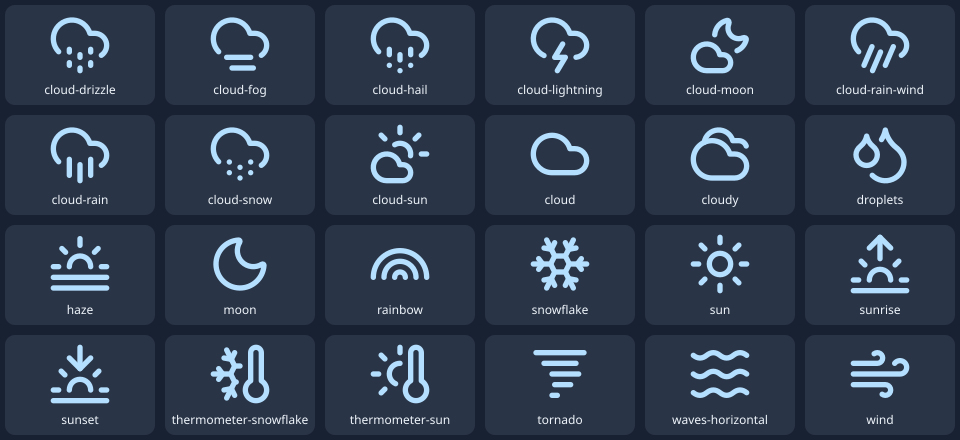
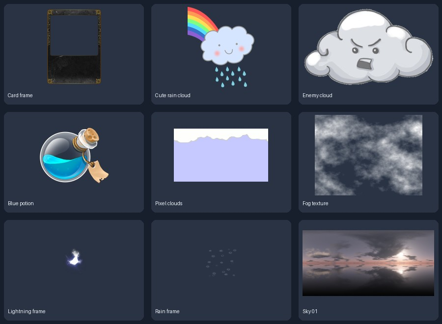

# Game-dev-src · 气象卡牌游戏素材库

## 新增：用户上传原版素材精选

[进入原版分类总览](Collections/sts-original/README.md)：**905个保留文件**，覆盖人物/NPC、敌人、UI、卡框、特效、地图、卡面、遗物、药水、背景和音效。另有**1709个暂不采用文件**放在[废弃目录](Discarded/sts-original/README.md)，保留原内容与恢复清单。

这批人物/敌人主要是**Spine3.4的2D骨骼资源**，没有3D模型；每套有实际动画名和配套文件说明，尚未做Unity导入测试。原版资源的来源与首批气象开源资源分别记录。

新增分类：[敌人](Enemies/README.md)、[卡牌插画](CardArt/README.md)、[音效](Audio/README.md)。

面向 Unity 类杀戮尖塔卡牌原型的第一批第三方素材精选。以天气、气象观测和自然环境为主，保留少量卡框、通用 UI、药水和地图节点例外。核查日期：2026-10-02。

第一批气象资源已入库 **17 组素材、179 个源素材/许可文件**（约 3.35 MiB），另有 **9 项来源索引**。不是单纯收藏链接：PNG、SVG、两份 7z 原归档均已实际保存。分包精选不代表完整原素材包；各包 README 有逐文件尺寸与用途。

## 分类入口

| 类别 | 已入库素材组 | 仅来源索引 |
|---|---:|---:|
| [卡牌边框](CardFrames/README.md) | 1 | 0 |
| [通用界面](UI/README.md) | 1 | 0 |
| [卡牌交互代码参考](UIFrameworks/README.md) | 0 | 1 |
| [天气与状态图标](WeatherIcons/README.md) | 2 | 1 |
| [气象仪器与遗物](Relics/README.md) | 1 | 0 |
| [事件插图与背景](EventBackgrounds/README.md) | 2 | 0 |
| [云角色与敌人](Characters/README.md) | 2 | 0 |
| [药水与消耗品](Potions/README.md) | 1 | 1 |
| [天气与战斗特效](VFX/README.md) | 3 | 2 |
| [路线地图与地形](Maps/README.md) | 3 | 0 |
| [天空贴图与 HDRI](SkyTextures/README.md) | 1 | 4 |

## 优先试用

1. [天气细线图标](WeatherIcons/weather-line/README.md)：24种天气/水热现象，适合状态栏和卡牌角标。
2. [气象遗物图标](Relics/instruments-line/README.md)：温度计、雷达、卫星等观测题材占位。
3. [可拆卡框](CardFrames/card-template/README.md)：替换原卡面文本，叠加天气插画。
4. [云精灵](Characters/cute-cloud/README.md)与[坏云敌人](Characters/bad-cloud/README.md)：补足天气主题角色。
5. [雨滴/闪电动画](VFX/spell-effects/README.md)：两个完整帧序列；不需要完整3D天气系统。
6. [路线节点](Maps/route-nodes-line/README.md)：战斗、事件、营地、商店；搭配地图符号。

素材的游戏用途是本仓库的设计建议，不是原作自带玩法。图标与插画不作为气象科学示意或真实仪器结构图。

## 使用与状态

- [Unity 导入建议](UnityImportGuide.md)：格式转换、透明度、动画排帧和最小验收步骤。
- [署名与来源](ATTRIBUTION.md)：按用户个人学习、非商用原型用途简明记录，不统一重授权第三方作品。
- [原推荐核对](RecommendationAudit.md)：纠正当前数量、作者来源、下载状态等，不把首页或旧描述算成已验证素材。
- [入库文件校验](manifest.json) / [原下载与归档清单](catalog.json) / [仅索引目录](references.json)。

**验证边界：** PNG已解码验证、SVG已XML解析、7z检查签名与哈希，文件来源和实际尺寸已记录。两份7z尚未解包；未启动Unity、未导入或运行测试、未生成`.meta`/材质/粒子预制体。当前环境未安装`game-dev`，本目录尚不是其canonical package。

**风格选择：** 细线状态图标、像素环境和金边奇幻卡框是候选视觉路线，先选用合适组合；调色不能自动统一不同画风。主体还缺定稿的天气卡牌主插画、玩家立绘和统一角色动作，本批可支持原型占位与视觉选择，不声称覆盖完整游戏美术。
