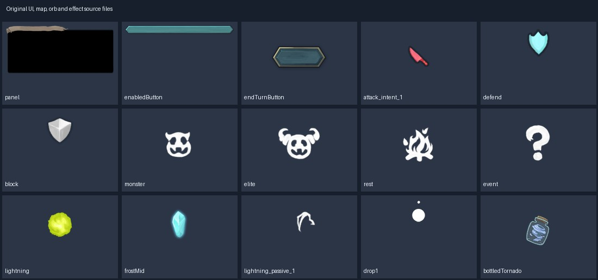

# 原版精选 · 界面与交互组件

选用战斗、敌人意图、回合按钮、顶部资源栏、事件、奖励、设置、商店、提示与卡库；排除手柄专用/每日/历史/品牌等页面。

本类保留 236 个源文件，约 2.50 MiB。文件内容保留原样；整体来源见 [本批说明](../../Collections/sts-original/README.md)。

## 分组说明

| 分组 | 文件数 | 主要情况 |
|---|---:|---|
| [campfire](campfire/README.md) | 11 | 界面与交互组件文件逐项规格/用途 |
| [cardlibrary](cardlibrary/README.md) | 11 | 界面与交互组件文件逐项规格/用途 |
| [combat](combat/README.md) | 17 | 界面与交互组件文件逐项规格/用途 |
| [cursors](cursors/README.md) | 2 | 界面与交互组件文件逐项规格/用途 |
| [deckButton](deckButton/README.md) | 2 | 界面与交互组件文件逐项规格/用途 |
| [dialog](dialog/README.md) | 7 | 界面与交互组件文件逐项规格/用途 |
| [discardButton](discardButton/README.md) | 2 | 界面与交互组件文件逐项规格/用途 |
| [event](event/README.md) | 5 | 界面与交互组件文件逐项规格/用途 |
| [intent](intent/README.md) | 46 | 界面与交互组件文件逐项规格/用途 |
| [option](option/README.md) | 17 | 界面与交互组件文件逐项规格/用途 |
| [potionPopUp](potionPopUp/README.md) | 4 | 界面与交互组件文件逐项规格/用途 |
| [reward](reward/README.md) | 7 | 界面与交互组件文件逐项规格/用途 |
| [shop](shop/README.md) | 14 | 界面与交互组件文件逐项规格/用途 |
| [tip](tip/README.md) | 8 | 界面与交互组件文件逐项规格/用途 |
| [topPanel](topPanel/README.md) | 67 | 界面与交互组件文件逐项规格/用途 |

## 本目录文件

| 文件 | 实际规格 | 字节数 | 用途/配套关系 |
|---|---|---:|---|
| [bossRelicScreenOverlay.png](bossRelicScreenOverlay.png) | 1024×766 P | 73487 | 功能UI部件 bossRelicScreenOverlay.png；保留原命名方便匹配 |
| [checkbox.png](checkbox.png) | 64×64 P | 1159 | 复选框；用Unity组件绑定对应行为 |
| [filterArrow.png](filterArrow.png) | 32×32 RGBA | 686 | 功能UI部件 filterArrow.png；保留原命名方便匹配 |
| [lineBreak.png](lineBreak.png) | 520×12 RGBA | 1645 | 功能UI部件 lineBreak.png；保留原命名方便匹配 |
| [popupArrow.png](popupArrow.png) | 256×256 P | 7917 | 功能UI部件 popupArrow.png；保留原命名方便匹配 |
| [relicFrameBoss.png](relicFrameBoss.png) | 1920×1080 P | 18917 | 功能UI部件 relicFrameBoss.png；保留原命名方便匹配 |
| [relicFrameCommon.png](relicFrameCommon.png) | 1920×1080 P | 14874 | 功能UI部件 relicFrameCommon.png；保留原命名方便匹配 |
| [relicFrameRare.png](relicFrameRare.png) | 1920×1080 P | 21387 | 功能UI部件 relicFrameRare.png；保留原命名方便匹配 |
| [relicFrameUncommon.png](relicFrameUncommon.png) | 1920×1080 P | 21636 | 功能UI部件 relicFrameUncommon.png；保留原命名方便匹配 |
| [relicPopup.png](relicPopup.png) | 1920×1080 P | 46195 | 功能UI部件 relicPopup.png；保留原命名方便匹配 |
| [scrollGradient.png](scrollGradient.png) | 1920×64 RGBA | 798 | 功能UI部件 scrollGradient.png；保留原命名方便匹配 |
| [selectBanner.png](selectBanner.png) | 1112×238 P | 33959 | 功能UI部件 selectBanner.png；保留原命名方便匹配 |
| [selectionBox.png](selectionBox.png) | 200×50 P | 525 | 选中框；用Unity组件绑定对应行为 |
| [tick.png](tick.png) | 64×64 P | 1553 | 勾选标记；用Unity组件绑定对应行为 |
| [timerIcon.png](timerIcon.png) | 64×64 P | 2230 | 功能UI部件 timerIcon.png；保留原命名方便匹配 |
| [white_gradient.png](white_gradient.png) | 960×64 RGBA | 11953 | 功能UI部件 white_gradient.png；保留原命名方便匹配 |
