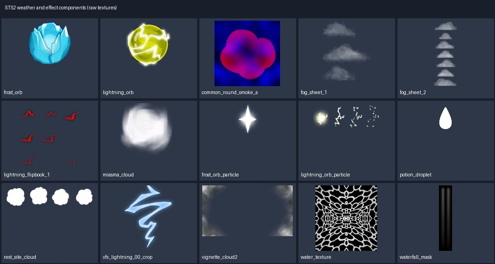

# Spire Codex · 气象与战斗特效贴图

来源为《Slay the Spire 2》主版本 v0.107.1 的站点导出图/预渲染结果。本类 49 项选用来源；[总说明](../../Collections/spire-codex-sts2/README.md)记录下载、来源与验证范围。

## orbs/dark_orb.webp

| 资源/PNG入口 | 规格 | 用途 | 原下载与存档 |
|---|---|---|---|
| [orbs/dark_orb](assets/orbs/dark_orb.png) | 100×100 RGBA | dark_orb：能量球/冰霜/闪电组件；不含球体的完整运行逻辑 | [源WebP](https://cdn.spire-codex.com/game/v0.107.1/assets/orbs/dark_orb.webp) / [原文件ZIP](../../Sources/spire-codex-sts2/vfx-01.zip)（成员 `assets/orbs/dark_orb.webp`） |
## orbs/empty_orb.webp

| 资源/PNG入口 | 规格 | 用途 | 原下载与存档 |
|---|---|---|---|
| [orbs/empty_orb](assets/orbs/empty_orb.png) | 100×100 RGBA | empty_orb：能量球/冰霜/闪电组件；不含球体的完整运行逻辑 | [源WebP](https://cdn.spire-codex.com/game/v0.107.1/assets/orbs/empty_orb.webp) / [原文件ZIP](../../Sources/spire-codex-sts2/vfx-01.zip)（成员 `assets/orbs/empty_orb.webp`） |
## orbs/frost_orb.webp

| 资源/PNG入口 | 规格 | 用途 | 原下载与存档 |
|---|---|---|---|
| [orbs/frost_orb](assets/orbs/frost_orb.png) | 100×100 RGBA | frost_orb：能量球/冰霜/闪电组件；不含球体的完整运行逻辑 | [源WebP](https://cdn.spire-codex.com/game/v0.107.1/assets/orbs/frost_orb.webp) / [原文件ZIP](../../Sources/spire-codex-sts2/vfx-01.zip)（成员 `assets/orbs/frost_orb.webp`） |
## orbs/glass_orb.webp

| 资源/PNG入口 | 规格 | 用途 | 原下载与存档 |
|---|---|---|---|
| [orbs/glass_orb](assets/orbs/glass_orb.png) | 100×100 RGBA | glass_orb：能量球/冰霜/闪电组件；不含球体的完整运行逻辑 | [源WebP](https://cdn.spire-codex.com/game/v0.107.1/assets/orbs/glass_orb.webp) / [原文件ZIP](../../Sources/spire-codex-sts2/vfx-01.zip)（成员 `assets/orbs/glass_orb.webp`） |
## orbs/lightning_orb.webp

| 资源/PNG入口 | 规格 | 用途 | 原下载与存档 |
|---|---|---|---|
| [orbs/lightning_orb](assets/orbs/lightning_orb.png) | 100×100 RGBA | lightning_orb：能量球/冰霜/闪电组件；不含球体的完整运行逻辑 | [源WebP](https://cdn.spire-codex.com/game/v0.107.1/assets/orbs/lightning_orb.webp) / [原文件ZIP](../../Sources/spire-codex-sts2/vfx-01.zip)（成员 `assets/orbs/lightning_orb.webp`） |
## orbs/plasma_orb.webp

| 资源/PNG入口 | 规格 | 用途 | 原下载与存档 |
|---|---|---|---|
| [orbs/plasma_orb](assets/orbs/plasma_orb.png) | 100×100 RGBA | plasma_orb：能量球/冰霜/闪电组件；不含球体的完整运行逻辑 | [源WebP](https://cdn.spire-codex.com/game/v0.107.1/assets/orbs/plasma_orb.webp) / [原文件ZIP](../../Sources/spire-codex-sts2/vfx-01.zip)（成员 `assets/orbs/plasma_orb.webp`） |
## vfx/bubble_particle.webp

| 资源/PNG入口 | 规格 | 用途 | 原下载与存档 |
|---|---|---|---|
| [vfx/bubble_particle](assets/vfx/bubble_particle.png) | 46×46 RGBA | bubble_particle：水、滴落、浪花/气泡效果图 | [源WebP](https://cdn.spire-codex.com/game/v0.107.1/assets/vfx/bubble_particle.webp) / [原文件ZIP](../../Sources/spire-codex-sts2/vfx-01.zip)（成员 `assets/vfx/bubble_particle.webp`） |
## vfx/common

| 资源/PNG入口 | 规格 | 用途 | 原下载与存档 |
|---|---|---|---|
| [vfx/common/common_circle](assets/vfx/common/common_circle.png) | 32×32 RGBA | common_circle：基础粒子或效果部件；不包含Unity预制体 | [源WebP](https://cdn.spire-codex.com/game/v0.107.1/assets/vfx/common/common_circle.webp) / [原文件ZIP](../../Sources/spire-codex-sts2/vfx-01.zip)（成员 `assets/vfx/common/common_circle.webp`） |
| [vfx/common/common_clean_flare_1](assets/vfx/common/common_clean_flare_1.png) | 256×256 RGBA | common_clean_flare_1：基础粒子或效果部件；不包含Unity预制体 | [源WebP](https://cdn.spire-codex.com/game/v0.107.1/assets/vfx/common/common_clean_flare_1.webp) / [原文件ZIP](../../Sources/spire-codex-sts2/vfx-01.zip)（成员 `assets/vfx/common/common_clean_flare_1.webp`） |
| [vfx/common/common_glow](assets/vfx/common/common_glow.png) | 128×128 RGBA | common_glow：基础粒子或效果部件；不包含Unity预制体 | [源WebP](https://cdn.spire-codex.com/game/v0.107.1/assets/vfx/common/common_glow.webp) / [原文件ZIP](../../Sources/spire-codex-sts2/vfx-01.zip)（成员 `assets/vfx/common/common_glow.webp`） |
| [vfx/common/common_horizontal_smoke](assets/vfx/common/common_horizontal_smoke.png) | 128×128 RGBA | common_horizontal_smoke：云雾/烟气效果图，按画面选择透明或加法混合 | [源WebP](https://cdn.spire-codex.com/game/v0.107.1/assets/vfx/common/common_horizontal_smoke.webp) / [原文件ZIP](../../Sources/spire-codex-sts2/vfx-01.zip)（成员 `assets/vfx/common/common_horizontal_smoke.webp`） |
| [vfx/common/common_round_smoke_a](assets/vfx/common/common_round_smoke_a.png) | 256×256 RGBA | common_round_smoke_a：云雾/烟气效果图，按画面选择透明或加法混合 | [源WebP](https://cdn.spire-codex.com/game/v0.107.1/assets/vfx/common/common_round_smoke_a.webp) / [原文件ZIP](../../Sources/spire-codex-sts2/vfx-01.zip)（成员 `assets/vfx/common/common_round_smoke_a.webp`） |
| [vfx/common/common_round_smoke_flipbook](assets/vfx/common/common_round_smoke_flipbook.png) | 512×512 RGBA | common_round_smoke_flipbook：源图内已排列的效果图表；没有核实网格/播放速率，保持整图待人工切片 | [源WebP](https://cdn.spire-codex.com/game/v0.107.1/assets/vfx/common/common_round_smoke_flipbook.webp) / [原文件ZIP](../../Sources/spire-codex-sts2/vfx-01.zip)（成员 `assets/vfx/common/common_round_smoke_flipbook.webp`） |
## vfx/fog_sheet_1.webp

| 资源/PNG入口 | 规格 | 用途 | 原下载与存档 |
|---|---|---|---|
| [vfx/fog_sheet_1](assets/vfx/fog_sheet_1.png) | 2472×3316 RGBA | fog_sheet_1：云雾/烟气效果图，按画面选择透明或加法混合 | [源WebP](https://cdn.spire-codex.com/game/v0.107.1/assets/vfx/fog_sheet_1.webp) / [原文件ZIP](../../Sources/spire-codex-sts2/vfx-01.zip)（成员 `assets/vfx/fog_sheet_1.webp`） |
## vfx/fog_sheet_2.webp

| 资源/PNG入口 | 规格 | 用途 | 原下载与存档 |
|---|---|---|---|
| [vfx/fog_sheet_2](assets/vfx/fog_sheet_2.png) | 252×700 RGBA | fog_sheet_2：云雾/烟气效果图，按画面选择透明或加法混合 | [源WebP](https://cdn.spire-codex.com/game/v0.107.1/assets/vfx/fog_sheet_2.webp) / [原文件ZIP](../../Sources/spire-codex-sts2/vfx-01.zip)（成员 `assets/vfx/fog_sheet_2.webp`） |
## vfx/lightning

| 资源/PNG入口 | 规格 | 用途 | 原下载与存档 |
|---|---|---|---|
| [vfx/lightning/lightning_flipbook_1](assets/vfx/lightning/lightning_flipbook_1.png) | 512×512 RGBA | lightning_flipbook_1：源图内已排列的效果图表；没有核实网格/播放速率，保持整图待人工切片 | [源WebP](https://cdn.spire-codex.com/game/v0.107.1/assets/vfx/lightning/lightning_flipbook_1.webp) / [原文件ZIP](../../Sources/spire-codex-sts2/vfx-01.zip)（成员 `assets/vfx/lightning/lightning_flipbook_1.webp`） |
| [vfx/lightning/lightning_flipbook_2](assets/vfx/lightning/lightning_flipbook_2.png) | 512×512 RGBA | lightning_flipbook_2：源图内已排列的效果图表；没有核实网格/播放速率，保持整图待人工切片 | [源WebP](https://cdn.spire-codex.com/game/v0.107.1/assets/vfx/lightning/lightning_flipbook_2.webp) / [原文件ZIP](../../Sources/spire-codex-sts2/vfx-01.zip)（成员 `assets/vfx/lightning/lightning_flipbook_2.webp`） |
## vfx/miasma_cloud.webp

| 资源/PNG入口 | 规格 | 用途 | 原下载与存档 |
|---|---|---|---|
| [vfx/miasma_cloud](assets/vfx/miasma_cloud.png) | 136×116 RGBA | miasma_cloud：云雾/烟气效果图，按画面选择透明或加法混合 | [源WebP](https://cdn.spire-codex.com/game/v0.107.1/assets/vfx/miasma_cloud.webp) / [原文件ZIP](../../Sources/spire-codex-sts2/vfx-01.zip)（成员 `assets/vfx/miasma_cloud.webp`） |
## vfx/monsters

| 资源/PNG入口 | 规格 | 用途 | 原下载与存档 |
|---|---|---|---|
| [vfx/monsters/living_smog/living_smog_smoke](assets/vfx/monsters/living_smog/living_smog_smoke.png) | 200×800 RGBA | living_smog_smoke：云雾/烟气效果图，按画面选择透明或加法混合 | [源WebP](https://cdn.spire-codex.com/game/v0.107.1/assets/vfx/monsters/living_smog/living_smog_smoke.webp) / [原文件ZIP](../../Sources/spire-codex-sts2/vfx-01.zip)（成员 `assets/vfx/monsters/living_smog/living_smog_smoke.webp`） |
| [vfx/monsters/living_smog/living_smog_smoke2](assets/vfx/monsters/living_smog/living_smog_smoke2.png) | 200×800 RGBA | living_smog_smoke2：云雾/烟气效果图，按画面选择透明或加法混合 | [源WebP](https://cdn.spire-codex.com/game/v0.107.1/assets/vfx/monsters/living_smog/living_smog_smoke2.webp) / [原文件ZIP](../../Sources/spire-codex-sts2/vfx-01.zip)（成员 `assets/vfx/monsters/living_smog/living_smog_smoke2.webp`） |
| [vfx/monsters/the_insatiable/sand_cloud](assets/vfx/monsters/the_insatiable/sand_cloud.png) | 800×200 RGBA | sand_cloud：云雾/烟气效果图，按画面选择透明或加法混合 | [源WebP](https://cdn.spire-codex.com/game/v0.107.1/assets/vfx/monsters/the_insatiable/sand_cloud.webp) / [原文件ZIP](../../Sources/spire-codex-sts2/vfx-01.zip)（成员 `assets/vfx/monsters/the_insatiable/sand_cloud.webp`） |
| [vfx/monsters/the_insatiable/sand_vfx](assets/vfx/monsters/the_insatiable/sand_vfx.png) | 260×150 RGBA | sand_vfx：基础粒子或效果部件；不包含Unity预制体 | [源WebP](https://cdn.spire-codex.com/game/v0.107.1/assets/vfx/monsters/the_insatiable/sand_vfx.webp) / [原文件ZIP](../../Sources/spire-codex-sts2/vfx-01.zip)（成员 `assets/vfx/monsters/the_insatiable/sand_vfx.webp`） |
| [vfx/monsters/waterfall_giant/waterfall_giant_water_tex](assets/vfx/monsters/waterfall_giant/waterfall_giant_water_tex.png) | 201×196 RGBA | waterfall_giant_water_tex：水、滴落、浪花/气泡效果图 | [源WebP](https://cdn.spire-codex.com/game/v0.107.1/assets/vfx/monsters/waterfall_giant/waterfall_giant_water_tex.webp) / [原文件ZIP](../../Sources/spire-codex-sts2/vfx-01.zip)（成员 `assets/vfx/monsters/waterfall_giant/waterfall_giant_water_tex.webp`） |
## vfx/noise_cloud_seamless.webp

| 资源/PNG入口 | 规格 | 用途 | 原下载与存档 |
|---|---|---|---|
| [vfx/noise_cloud_seamless](assets/vfx/noise_cloud_seamless.png) | 512×512 RGBA | noise_cloud_seamless：噪声/水流扰动候选纹理；不据名称保证无缝 | [源WebP](https://cdn.spire-codex.com/game/v0.107.1/assets/vfx/noise_cloud_seamless.webp) / [原文件ZIP](../../Sources/spire-codex-sts2/vfx-01.zip)（成员 `assets/vfx/noise_cloud_seamless.webp`） |
## vfx/orbs

| 资源/PNG入口 | 规格 | 用途 | 原下载与存档 |
|---|---|---|---|
| [vfx/orbs/dark_orb_particle](assets/vfx/orbs/dark_orb_particle.png) | 48×139 RGBA | dark_orb_particle：能量球/冰霜/闪电组件；不含球体的完整运行逻辑 | [源WebP](https://cdn.spire-codex.com/game/v0.107.1/assets/vfx/orbs/dark_orb_particle.webp) / [原文件ZIP](../../Sources/spire-codex-sts2/vfx-01.zip)（成员 `assets/vfx/orbs/dark_orb_particle.webp`） |
| [vfx/orbs/frost_orb_particle](assets/vfx/orbs/frost_orb_particle.png) | 58×68 RGBA | frost_orb_particle：能量球/冰霜/闪电组件；不含球体的完整运行逻辑 | [源WebP](https://cdn.spire-codex.com/game/v0.107.1/assets/vfx/orbs/frost_orb_particle.webp) / [原文件ZIP](../../Sources/spire-codex-sts2/vfx-01.zip)（成员 `assets/vfx/orbs/frost_orb_particle.webp`） |
| [vfx/orbs/lightning_orb_particle](assets/vfx/orbs/lightning_orb_particle.png) | 141×64 RGBA | lightning_orb_particle：能量球/冰霜/闪电组件；不含球体的完整运行逻辑 | [源WebP](https://cdn.spire-codex.com/game/v0.107.1/assets/vfx/orbs/lightning_orb_particle.webp) / [原文件ZIP](../../Sources/spire-codex-sts2/vfx-01.zip)（成员 `assets/vfx/orbs/lightning_orb_particle.webp`） |
| [vfx/orbs/plasma_orb_particle](assets/vfx/orbs/plasma_orb_particle.png) | 50×50 RGBA | plasma_orb_particle：能量球/冰霜/闪电组件；不含球体的完整运行逻辑 | [源WebP](https://cdn.spire-codex.com/game/v0.107.1/assets/vfx/orbs/plasma_orb_particle.webp) / [原文件ZIP](../../Sources/spire-codex-sts2/vfx-01.zip)（成员 `assets/vfx/orbs/plasma_orb_particle.webp`） |
| [vfx/orbs/plasma_orb_particle_no_glow](assets/vfx/orbs/plasma_orb_particle_no_glow.png) | 51×50 RGBA | plasma_orb_particle_no_glow：能量球/冰霜/闪电组件；不含球体的完整运行逻辑 | [源WebP](https://cdn.spire-codex.com/game/v0.107.1/assets/vfx/orbs/plasma_orb_particle_no_glow.webp) / [原文件ZIP](../../Sources/spire-codex-sts2/vfx-01.zip)（成员 `assets/vfx/orbs/plasma_orb_particle_no_glow.webp`） |
## vfx/potion

| 资源/PNG入口 | 规格 | 用途 | 原下载与存档 |
|---|---|---|---|
| [vfx/potion/potion_droplet](assets/vfx/potion/potion_droplet.png) | 64×64 RGBA | potion_droplet：水、滴落、浪花/气泡效果图 | [源WebP](https://cdn.spire-codex.com/game/v0.107.1/assets/vfx/potion/potion_droplet.webp) / [原文件ZIP](../../Sources/spire-codex-sts2/vfx-01.zip)（成员 `assets/vfx/potion/potion_droplet.webp`） |
| [vfx/potion/potion_splash](assets/vfx/potion/potion_splash.png) | 512×512 RGBA | potion_splash：水、滴落、浪花/气泡效果图 | [源WebP](https://cdn.spire-codex.com/game/v0.107.1/assets/vfx/potion/potion_splash.webp) / [原文件ZIP](../../Sources/spire-codex-sts2/vfx-01.zip)（成员 `assets/vfx/potion/potion_splash.webp`） |
## vfx/rest_site_cloud.webp

| 资源/PNG入口 | 规格 | 用途 | 原下载与存档 |
|---|---|---|---|
| [vfx/rest_site_cloud](assets/vfx/rest_site_cloud.png) | 800×200 RGBA | rest_site_cloud：云雾/烟气效果图，按画面选择透明或加法混合 | [源WebP](https://cdn.spire-codex.com/game/v0.107.1/assets/vfx/rest_site_cloud.webp) / [原文件ZIP](../../Sources/spire-codex-sts2/vfx-01.zip)（成员 `assets/vfx/rest_site_cloud.webp`） |
## vfx/shared_use

| 资源/PNG入口 | 规格 | 用途 | 原下载与存档 |
|---|---|---|---|
| [vfx/shared_use/ash_particle](assets/vfx/shared_use/ash_particle.png) | 32×32 RGBA | ash_particle：基础粒子或效果部件；不包含Unity预制体 | [源WebP](https://cdn.spire-codex.com/game/v0.107.1/assets/vfx/shared_use/ash_particle.webp) / [原文件ZIP](../../Sources/spire-codex-sts2/vfx-01.zip)（成员 `assets/vfx/shared_use/ash_particle.webp`） |
| [vfx/shared_use/smoke_vfx](assets/vfx/shared_use/smoke_vfx.png) | 256×256 RGBA | smoke_vfx：云雾/烟气效果图，按画面选择透明或加法混合 | [源WebP](https://cdn.spire-codex.com/game/v0.107.1/assets/vfx/shared_use/smoke_vfx.webp) / [原文件ZIP](../../Sources/spire-codex-sts2/vfx-01.zip)（成员 `assets/vfx/shared_use/smoke_vfx.webp`） |
| [vfx/shared_use/smoke_vfx_flat](assets/vfx/shared_use/smoke_vfx_flat.png) | 256×256 RGBA | smoke_vfx_flat：云雾/烟气效果图，按画面选择透明或加法混合 | [源WebP](https://cdn.spire-codex.com/game/v0.107.1/assets/vfx/shared_use/smoke_vfx_flat.webp) / [原文件ZIP](../../Sources/spire-codex-sts2/vfx-01.zip)（成员 `assets/vfx/shared_use/smoke_vfx_flat.webp`） |
## vfx/ui

| 资源/PNG入口 | 规格 | 用途 | 原下载与存档 |
|---|---|---|---|
| [vfx/ui/card/afflictions/galvanized/ui_card_galvanized_lightning_corner_flipbook](assets/vfx/ui/card/afflictions/galvanized/ui_card_galvanized_lightning_corner_flipbook.png) | 256×256 RGBA | ui_card_galvanized_lightning_corner_flipbook：源图内已排列的效果图表；没有核实网格/播放速率，保持整图待人工切片 | [源WebP](https://cdn.spire-codex.com/game/v0.107.1/assets/vfx/ui/card/afflictions/galvanized/ui_card_galvanized_lightning_corner_flipbook.webp) / [原文件ZIP](../../Sources/spire-codex-sts2/vfx-01.zip)（成员 `assets/vfx/ui/card/afflictions/galvanized/ui_card_galvanized_lightning_corner_flipbook.webp`） |
| [vfx/ui/card/afflictions/galvanized/ui_card_galvanized_main](assets/vfx/ui/card/afflictions/galvanized/ui_card_galvanized_main.png) | 256×256 RGBA | ui_card_galvanized_main：基础粒子或效果部件；不包含Unity预制体 | [源WebP](https://cdn.spire-codex.com/game/v0.107.1/assets/vfx/ui/card/afflictions/galvanized/ui_card_galvanized_main.webp) / [原文件ZIP](../../Sources/spire-codex-sts2/vfx-01.zip)（成员 `assets/vfx/ui/card/afflictions/galvanized/ui_card_galvanized_main.webp`） |
| [vfx/ui/card/afflictions/smog/ui_card_smog_mask](assets/vfx/ui/card/afflictions/smog/ui_card_smog_mask.png) | 256×256 RGBA | ui_card_smog_mask：效果遮罩；需材质组合使用 | [源WebP](https://cdn.spire-codex.com/game/v0.107.1/assets/vfx/ui/card/afflictions/smog/ui_card_smog_mask.webp) / [原文件ZIP](../../Sources/spire-codex-sts2/vfx-01.zip)（成员 `assets/vfx/ui/card/afflictions/smog/ui_card_smog_mask.webp`） |
| [vfx/ui/card/afflictions/smog/ui_card_smog_mask_outer](assets/vfx/ui/card/afflictions/smog/ui_card_smog_mask_outer.png) | 256×256 RGBA | ui_card_smog_mask_outer：效果遮罩；需材质组合使用 | [源WebP](https://cdn.spire-codex.com/game/v0.107.1/assets/vfx/ui/card/afflictions/smog/ui_card_smog_mask_outer.webp) / [原文件ZIP](../../Sources/spire-codex-sts2/vfx-01.zip)（成员 `assets/vfx/ui/card/afflictions/smog/ui_card_smog_mask_outer.webp`） |
## vfx/vfx_lightning

| 资源/PNG入口 | 规格 | 用途 | 原下载与存档 |
|---|---|---|---|
| [vfx/vfx_lightning/vfx_lightning_00_crop](assets/vfx/vfx_lightning/vfx_lightning_00_crop.png) | 267×324 RGBA | vfx_lightning_00_crop：雷电效果候选图/形状变体；不把不同编号默认作连续动画 | [源WebP](https://cdn.spire-codex.com/game/v0.107.1/assets/vfx/vfx_lightning/vfx_lightning_00_crop.webp) / [原文件ZIP](../../Sources/spire-codex-sts2/vfx-01.zip)（成员 `assets/vfx/vfx_lightning/vfx_lightning_00_crop.webp`） |
| [vfx/vfx_lightning/vfx_lightning_01b_crop](assets/vfx/vfx_lightning/vfx_lightning_01b_crop.png) | 278×926 RGBA | vfx_lightning_01b_crop：雷电效果候选图/形状变体；不把不同编号默认作连续动画 | [源WebP](https://cdn.spire-codex.com/game/v0.107.1/assets/vfx/vfx_lightning/vfx_lightning_01b_crop.webp) / [原文件ZIP](../../Sources/spire-codex-sts2/vfx-01.zip)（成员 `assets/vfx/vfx_lightning/vfx_lightning_01b_crop.webp`） |
| [vfx/vfx_lightning/vfx_lightning_02_crop](assets/vfx/vfx_lightning/vfx_lightning_02_crop.png) | 461×312 RGBA | vfx_lightning_02_crop：雷电效果候选图/形状变体；不把不同编号默认作连续动画 | [源WebP](https://cdn.spire-codex.com/game/v0.107.1/assets/vfx/vfx_lightning/vfx_lightning_02_crop.webp) / [原文件ZIP](../../Sources/spire-codex-sts2/vfx-01.zip)（成员 `assets/vfx/vfx_lightning/vfx_lightning_02_crop.webp`） |
| [vfx/vfx_lightning/vfx_lightning_03_crop](assets/vfx/vfx_lightning/vfx_lightning_03_crop.png) | 354×679 RGBA | vfx_lightning_03_crop：雷电效果候选图/形状变体；不把不同编号默认作连续动画 | [源WebP](https://cdn.spire-codex.com/game/v0.107.1/assets/vfx/vfx_lightning/vfx_lightning_03_crop.webp) / [原文件ZIP](../../Sources/spire-codex-sts2/vfx-01.zip)（成员 `assets/vfx/vfx_lightning/vfx_lightning_03_crop.webp`） |
| [vfx/vfx_lightning/vfx_lightning_04_crop](assets/vfx/vfx_lightning/vfx_lightning_04_crop.png) | 225×513 RGBA | vfx_lightning_04_crop：雷电效果候选图/形状变体；不把不同编号默认作连续动画 | [源WebP](https://cdn.spire-codex.com/game/v0.107.1/assets/vfx/vfx_lightning/vfx_lightning_04_crop.webp) / [原文件ZIP](../../Sources/spire-codex-sts2/vfx-01.zip)（成员 `assets/vfx/vfx_lightning/vfx_lightning_04_crop.webp`） |
## vfx/vignette_cloud2.webp

| 资源/PNG入口 | 规格 | 用途 | 原下载与存档 |
|---|---|---|---|
| [vfx/vignette_cloud2](assets/vfx/vignette_cloud2.png) | 1024×576 RGBA | vignette_cloud2：云雾/烟气效果图，按画面选择透明或加法混合 | [源WebP](https://cdn.spire-codex.com/game/v0.107.1/assets/vfx/vignette_cloud2.webp) / [原文件ZIP](../../Sources/spire-codex-sts2/vfx-01.zip)（成员 `assets/vfx/vignette_cloud2.webp`） |
## vfx/water_texture.webp

| 资源/PNG入口 | 规格 | 用途 | 原下载与存档 |
|---|---|---|---|
| [vfx/water_texture](assets/vfx/water_texture.png) | 600×636 RGBA | water_texture：水、滴落、浪花/气泡效果图 | [源WebP](https://cdn.spire-codex.com/game/v0.107.1/assets/vfx/water_texture.webp) / [原文件ZIP](../../Sources/spire-codex-sts2/vfx-01.zip)（成员 `assets/vfx/water_texture.webp`） |
## vfx/waterfall_mask.webp

| 资源/PNG入口 | 规格 | 用途 | 原下载与存档 |
|---|---|---|---|
| [vfx/waterfall_mask](assets/vfx/waterfall_mask.png) | 100×500 RGBA | waterfall_mask：效果遮罩；需材质组合使用 | [源WebP](https://cdn.spire-codex.com/game/v0.107.1/assets/vfx/waterfall_mask.webp) / [原文件ZIP](../../Sources/spire-codex-sts2/vfx-01.zip)（成员 `assets/vfx/waterfall_mask.webp`） |
## vfx/waterfall_noise.webp

| 资源/PNG入口 | 规格 | 用途 | 原下载与存档 |
|---|---|---|---|
| [vfx/waterfall_noise](assets/vfx/waterfall_noise.png) | 1024×1024 RGBA | waterfall_noise：噪声/水流扰动候选纹理；不据名称保证无缝 | [源WebP](https://cdn.spire-codex.com/game/v0.107.1/assets/vfx/waterfall_noise.webp) / [原文件ZIP](../../Sources/spire-codex-sts2/vfx-01.zip)（成员 `assets/vfx/waterfall_noise.webp`） |
## vfx/waterfall_noise_tile.webp

| 资源/PNG入口 | 规格 | 用途 | 原下载与存档 |
|---|---|---|---|
| [vfx/waterfall_noise_tile](assets/vfx/waterfall_noise_tile.png) | 500×500 RGBA | waterfall_noise_tile：噪声/水流扰动候选纹理；不据名称保证无缝 | [源WebP](https://cdn.spire-codex.com/game/v0.107.1/assets/vfx/waterfall_noise_tile.webp) / [原文件ZIP](../../Sources/spire-codex-sts2/vfx-01.zip)（成员 `assets/vfx/waterfall_noise_tile.webp`） |

PNG转换保留源WebP解码后的RGBA像素与透明度。图表与单张PNG均已读取检查，Unity尚未导入运行。原SHA256、图表坐标与取舍记录见[清单](../../Collections/spire-codex-sts2/manifest.json)。
